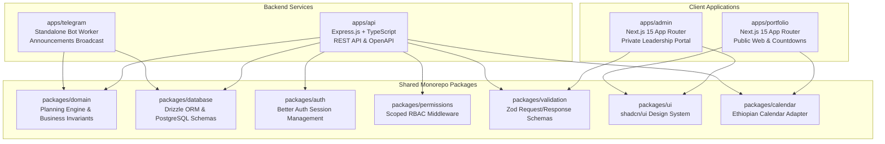
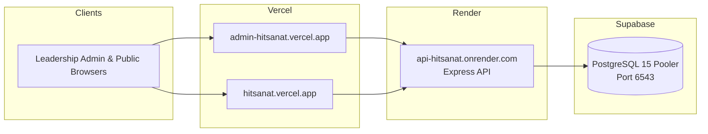

# Hitsanat Kifl — Children's Ministry Management System

[](docs/architecture/system-architecture.md)
[](https://www.typescriptlang.org/)
[](https://nextjs.org/)
[](https://expressjs.com/)
[](https://orm.drizzle.team/)
[](https://www.postgresql.org/)
[](LICENSE)

**Haramaya University Gibi Gubae Orthodox Tewahedo Student Association**  
Digital management platform engineered for spiritual education, choir rehearsals, attendance tracking, family pastoral mentorship, and strategic annual action planning.

---

## 📖 Table of Contents

- [Overview & Purpose](#-overview--purpose)
- [System Architecture](#-system-architecture)
- [Monorepo Structure](#-monorepo-structure)
- [Documentation Index](#-documentation-index)
- [Technology Stack](#-technology-stack)
- [Getting Started](#-getting-started)
- [Available Scripts & Quality Gates](#-available-scripts--quality-gates)
- [Team & Contribution Guidelines](#-team--contribution-guidelines)
- [Deployment Topology](#-deployment-topology)

---

## 🌟 Overview & Purpose

The **Hitsanat Kifl Children's Ministry Management System** is a unified digital platform built to coordinate, monitor, and report on the activities of the Children's Ministry at Haramaya University Gibi Gubae.

The platform provides two primary interfaces:
1. **Leadership Management Portal (`apps/admin`):** A private, role-based administration dashboard for Executive Leaders, Sub-Department Heads (*Timihrt, Mezmur, Kutitr, Ekd, Kinetibeb*), and Family Mentors. Zero login access is granted to regular members (ADR-0007).
2. **Public Portfolio Website (`apps/portfolio`):** A public web presence hosted at [hitsanat.vercel.app](https://hitsanat.vercel.app) featuring upcoming feast countdowns (*Timket, Hosaena*), ministry galleries, announcements, and program overviews.

---

## 🏛️ System Architecture

The codebase is organized as a **Modular Monolith** applying **Clean Architecture** and **Domain-Driven Design (DDD)** principles:



---

## 📁 Monorepo Structure

```text
hitsanat/
├── apps/
│   ├── admin/                 # Next.js 15 Leadership Management Portal
│   ├── portfolio/             # Next.js 15 Public Website & Event Showcase
│   ├── api/                   # Express.js REST API with Swagger UI (/api/docs)
│   └── telegram/              # Standalone Telegram Broadcast Worker
│
├── packages/
│   ├── database/              # Drizzle ORM schemas, migrations & seed scripts
│   ├── domain/                # Pure business logic & 3-factor weight engine
│   ├── auth/                  # Better Auth configuration & adapters
│   ├── permissions/           # Scoped RBAC guards & role matrices
│   ├── validation/            # Shared Zod validation schemas
│   ├── ui/                    # shadcn/ui shared components (preset b1D0f7S7)
│   ├── calendar/              # Ethiopian Calendar conversion utilities
│   ├── typescript-config/     # Shared tsconfig definitions
│   └── eslint-config/         # Shared linter configurations
│
└── docs/                      # Authoritative Technical & Engineering Documentation
    ├── README.md              # Documentation suite master index
    ├── open-decisions.md      # Architecture trade-offs & open decisions (OD-01 to OD-04)
    ├── requirements/          # Business, functional, non-functional rules & RBAC
    ├── architecture/          # C4 diagrams, Clean Architecture, security & deployment
    ├── database/              # Schema definitions, ERDs, constraints & migrations
    ├── api/                   # REST API conventions, endpoints & error handling
    ├── modules/               # 11 Feature module deep-dives
    ├── planning/              # Action PLN (2016 E.C.) normalization & weight formulas
    ├── frontend/              # UI system, design tokens, dashboards & navigation
    ├── backend/               # Express DDD vertical slices, auth & authorization
    ├── testing/               # Layered test strategy (Vitest, Docker, Playwright)
    ├── ci-cd/                 # GitHub Actions, local-ci gates, deployment
    ├── team/                  # 5-person ownership lanes, git workflows, CODEOWNERS
    ├── deployment/            # Free-tier cloud guide (Vercel, Render, Supabase)
    ├── adr/                   # Architecture Decision Records (ADR-0001 to ADR-0017)
    ├── development/           # Local setup, coding standards & contributor handbook
    └── roadmap/               # 5 Release phases, task assignments & traceability
```

---

## 📚 Documentation Index

The complete engineering documentation suite is available under [`docs/`](docs/README.md):

| Documentation Section | Description |
| :--- | :--- |
| [**System Overview & Index**](docs/README.md) | High-level master documentation index and architecture map. |
| [**Architecture Decision Records (ADRs)**](docs/adr/README.md) | 17 Authoritative ADRs (ADR-0001 to ADR-0017) establishing technical constraints. |
| [**Roles & Scoped RBAC Matrix**](docs/requirements/roles-and-permissions.md) | Scoped access controls across Executive, Sub-Departments, and Families. |
| [**Database ERD & Entities**](docs/database/entities.md) | Complete PostgreSQL schema definitions and relationships. |
| [**REST API Specifications**](docs/api/endpoints.md) | Exhaustive REST endpoint catalog across all 11 business modules. |
| [**Annual Master Plan Normalization**](docs/planning/annual-master-plan.md) | 6 Goals, 25 Activities, and 3-factor weight mathematical engine. |
| [**Implementation Roadmap**](docs/roadmap/implementation-roadmap.md) | 5 Phased development milestones and acceptance criteria. |
| [**Task Assignment Matrix**](docs/roadmap/task-assignments.md) | Granular P0/P1/P2 engineering tasks mapped to owners and reviewers. |
| [**Team Ownership & Lanes**](docs/team/ownership.md) | 5-person contributor lane architecture (Abrham, Israel, Frontend devs). |

---

## 💻 Technology Stack

| Layer | Technologies & Tools |
| :--- | :--- |
| **Frontend Applications** | Next.js 15 (App Router), React 19, Tailwind CSS, shadcn/ui (preset `b1D0f7S7`), TanStack Query v5, React Hook Form |
| **Backend REST API** | Node.js 24, Express.js, TypeScript, Better Auth, Zod, OpenAPI 3.1 / Swagger UI |
| **Persistence & ORM** | PostgreSQL 15 (Supabase), Drizzle ORM, Drizzle Kit |
| **Calendar Engine** | `ethiopian-calendar-new` (bidirectional Gregorian $\leftrightarrow$ Ethiopian conversion) |
| **Quality & Tooling** | Turborepo, Biome, Vitest, Playwright, Docker Compose |
| **Cloud Hosting** | Vercel (Edge frontends), Render (API web service), Supabase (PostgreSQL Pooler) |

---

## 🚀 Getting Started

### Prerequisites
- **Node.js**: `v24.x` or higher
- **pnpm**: `v11.x` or higher (`corepack enable && corepack prepare pnpm@latest --activate`)
- **Docker**: Docker Desktop (for local PostgreSQL database)

### Local Setup Instructions

1. **Clone the repository:**
   ```bash
   git clone https://github.com/Hitsanat-Kfl/hitsanat.git
   cd hitsanat
   ```

2. **Install monorepo dependencies:**
   ```bash
   pnpm install
   ```

3. **Start local database container:**
   ```bash
   docker compose up -d
   ```

4. **Configure environment variables:**
   ```bash
   cp .env.example .env
   ```

5. **Run database migrations & seed reference data:**
   ```bash
   pnpm db:migrate
   pnpm db:seed
   ```

6. **Start all development services:**
   ```bash
   pnpm dev
   ```
   - **Leadership Admin Portal:** `http://localhost:3000`
   - **Public Portfolio Website:** `http://localhost:3001`
   - **Backend API & Swagger UI:** `http://localhost:4000/api/docs`

---

## 🧪 Available Scripts & Quality Gates

The project enforces a strict local quality gate before pushing changes (ADR-0015):

| Command | Purpose |
| :--- | :--- |
| `pnpm prepare` | **Mandatory Local Quality Gate:** Runs typecheck, Biome linting, and unit tests. |
| `pnpm dev` | Starts all applications in watch mode via Turborepo. |
| `pnpm build` | Compiles all packages and builds production bundles. |
| `pnpm test:unit` | Executes Vitest unit tests across domain and calendar packages. |
| `pnpm test:integration`| Executes integration tests against local Docker PostgreSQL. |
| `pnpm test:e2e` | Runs Playwright end-to-end multi-role tests. |
| `pnpm db:generate` | Generates new Drizzle SQL migration files from schema changes. |
| `pnpm db:migrate` | Applies pending migrations to the active database. |

---

## 👥 Team & Contribution Guidelines

The project uses a **5-Person Multi-Lane Ownership Architecture** (ADR-0016):
- **Core Technical Lead (Abrham):** Final authority on architecture, database schemas, auth/RBAC, math engine, and production releases.
- **Supporting Backend Contributor (Israel):** Implements module CRUD endpoints, Zod validations, report aggregators, and seed data.
- **Frontend Contributors:** Implement UI design system components, admin layouts, checksheet tables, and public web experiences.

### Pull Request Workflow
1. Branch from `main` using naming convention: `feat/<module>-<description>` or `fix/<module>-<description>`.
2. Ensure `pnpm prepare` passes with **0 errors and 0 warnings**.
3. Open a Pull Request against `main`. All PRs require approval from the Core Technical Lead before merge.

---

## ☁️ Deployment Topology

The production environment operates within a 100% free-tier cloud architecture:



---

## 📄 License

This project is licensed under the MIT License — see the [LICENSE](LICENSE) file for details.
