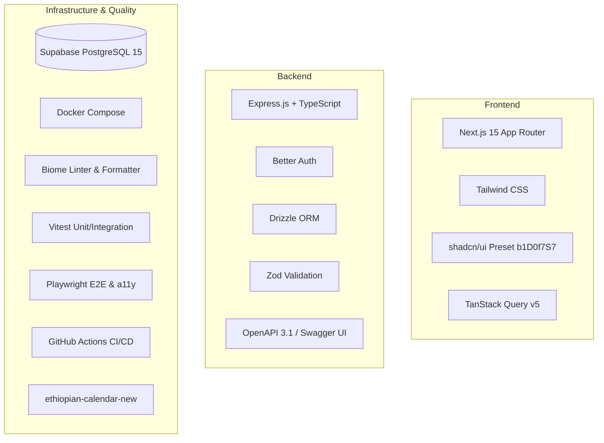

# Hitsanat Kifl System Engineering Documentation

## Children's Ministry Management System
**Haramaya University Gibi Gubae — Orthodox Tewahedo Student Association**  
**Engineering Documentation Suite — Version 2.1 (August 2026)**  
**Architecture:** Modular Monolith · Clean Architecture · Domain-Driven Design · Scoped RBAC  

---

## 1. Executive Summary & System Purpose

The **Hitsanat Kifl Children's Ministry Management System** is a unified digital platform engineered to manage, streamline, and monitor the spiritual education, hymn rehearsals, attendance tracking, family mentorship, and strategic planning of the Children's Ministry at Haramaya University Gibi Gubae.

The platform serves two primary user categories across distinct interfaces:
1. **Ministry Leadership (Executive & Sub-Department Leaders):** Access the private, role-based Management Portal (`apps/admin`) to register members/children, track attendance, manage syllabi, schedule events, and execute the Annual Master Plan.
2. **Student Servants, Parents & General Public:** Access the public Portfolio Website (`apps/portfolio` at [hitsanat.vercel.app](https://hitsanat.vercel.app)) with live event countdowns, ministry announcements, and public program overviews (**Zero login required for regular members**).

---

## 2. Documentation Architecture & Directory Map

The documentation is organized into comprehensive, implementation-ready specifications:

```text
docs/
├── README.md                                  # Master Documentation Index (This Document)
├── open-decisions.md                          # Registry of Unresolved Decisions & Trade-offs
│
├── requirements/                              # Functional & Non-Functional Specifications
│   ├── business-requirements.md               # Ministry context, mission, stakeholder taxonomy
│   ├── functional-requirements.md             # Granular functional requirements (FR-01 to FR-12)
│   ├── non-functional-requirements.md         # Latency, security, PII protection, mobile-first
│   ├── business-rules.md                      # Invariant business rules (BR-001 to BR-034)
│   ├── roles-and-permissions.md               # Scoped RBAC matrix across all roles & scopes
│   └── workflows.md                           # Saturday/Sunday schedules, planning roll-ups
│
├── architecture/                              # System & Domain Architecture
│   ├── system-architecture.md                 # C4 Context diagram, Turborepo structure, Clean Arch
│   ├── domain-model.md                        # Ubiquitous language, Aggregates, Entities, Value Objects
│   ├── module-architecture.md                 # Structure of apps/api/src/modules/
│   ├── data-architecture.md                   # Relational modeling, Gregorian storage, audit logs
│   ├── security-architecture.md               # Better Auth, Scoped guards, PII protection
│   └── deployment-architecture.md             # Cloud topology (Vercel & Railway)
│
├── database/                                  # Database Design & Modeling
│   ├── database-design.md                     # PostgreSQL principles, UUIDs, soft-deletes
│   ├── entities.md                            # Comprehensive table schemas with data types
│   ├── relationships.md                       # Complete ERD (Mermaid) & foreign key actions
│   ├── constraints.md                         # Check constraints, composite unique indexes, tuning
│   └── migrations.md                          # Drizzle Kit migration & reference seeding strategy
│
├── api/                                       # REST API & OpenAPI Specifications
│   ├── overview.md                            # Conventions, standard envelope, query filtering
│   ├── authentication.md                      # Better Auth endpoints, session cookies
│   ├── authorization.md                       # Scoped RBAC guards (requireScopePermission)
│   ├── endpoints.md                           # Exhaustive endpoint catalog across all 11 modules
│   ├── openapi.md                             # Zod-to-OpenAPI generation pipeline
│   ├── swagger.md                             # Interactive Swagger UI (/api/docs) setup
│   └── error-handling.md                      # RFC 7807 error taxonomy & Express error handler
│
├── modules/                                   # Feature-by-Feature Deep Dives
│   ├── members.md                             # Student servant lifecycle & 2-stage registration
│   ├── children.md                            # Child beneficiaries, Kutr 1/2 cohorts, birthdays
│   ├── parents.md                             # Parent records & strict cardinality (max 1 Father, 1 Mother)
│   ├── families.md                            # Pastoral family units (Khnet), Fathers & Mothers
│   ├── sub-departments.md                     # Timihrt, Mezmur, Kutitr, Ekd, Kinetibeb charters
│   ├── attendance.md                          # Auto-seeding attendance & 5 transport routes
│   ├── academic-tracking.md                   # Spiritual syllabus, exams & scoring gradebook
│   ├── planning.md                            # Strategic planning engine & Action PLN normalization
│   ├── events.md                              # Feasts (Timket, Hosaena), countdowns & rehearsals
│   ├── reports.md                             # Periodic report consolidation (Weekly to Annual)
│   ├── announcements.md                       # Public web & Telegram broadcasts
│   └── calendar.md                            # Ethiopian calendar conversion adapter
│
├── planning/                                  # Strategic Action Plan Breakdown
│   ├── annual-master-plan.md                  # 6 Master Goals, 25 Activities, Action PLN data
│   ├── plan-distribution.md                   # Distribution matrix across 5 sub-departments
│   ├── quarterly-planning.md                  # Q1 to Q4 academic quarter breakdowns
│   ├── monthly-planning.md                    # 9-month operational target distribution
│   ├── weekly-planning.md                     # Saturday/Sunday weekly task scheduling
│   ├── progress-tracking.md                   # Bottom-up progress roll-up & KPI formulas
│   └── reporting.md                           # Performance index & budget tracking
│
├── frontend/                                  # Next.js Applications & Design System
│   ├── architecture.md                        # Next.js 15 App Router, React 19, TanStack Query
│   ├── ui-system.md                           # Design tokens, Ge'ez font stack, mobile rules
│   ├── shadcn.md                              # Preset b1D0f7S7 setup & packages/ui components
│   ├── navigation.md                          # Role-filtered dynamic sidebar & mobile drawer
│   └── dashboards.md                          # Specifications for all 8 leadership dashboards
│
├── backend/                                   # Express.js Backend Architecture
│   ├── architecture.md                        # DDD layers, Presentation/Application/Domain/Infra
│   ├── express.md                             # Server bootstrap, security middlewares, health check
│   ├── modules.md                             # Module boundaries & vertical slice organization
│   ├── authentication.md                      # Better Auth Drizzle adapter & cookie configs
│   └── authorization.md                       # Scoped RBAC evaluation algorithm
│
├── testing/                                   # Layered Quality Assurance Strategy
│   ├── strategy.md                            # Testing pyramid & quality gates
│   ├── unit.md                                # Vitest unit tests on domain & weight engines
│   ├── integration.md                         # Vitest + Real PostgreSQL in Docker
│   ├── component.md                           # Vitest + React Testing Library UI tests
│   ├── e2e.md                                 # Playwright multi-role leadership journeys
│   ├── accessibility.md                       # Playwright + axe WCAG 2.1 Level AA audits
│   └── security.md                            # Negative RBAC tests & regular member lockout
│
├── ci-cd/                                     # Automation & Release Engineering
│   ├── github-actions.md                      # Complete .github/workflows/ci.yml pipeline
│   ├── local-ci.md                            # pnpm prepare local verification command
│   ├── branch-protection.md                   # GitHub branch protection rules for main
│   └── deployment.md                          # CD pipeline to Vercel and Railway
│
├── team/                                      # Governance & Development Workflow
│   ├── ownership.md                           # 5-person team structure (Core, Israel, Frontend)
│   ├── git-workflow.md                        # Feature branch lifecycle & commit standards
│   ├── contribution-workflow.md               # Step-by-step PR guide & review checklists
│   └── codeowners.md                          # GitHub CODEOWNERS path ownership rules
│
├── deployment/                                # Hosting & Operations
│   ├── overview.md                            # Cloud map & cost summary (~$3/mo)
│   ├── vercel.md                              # Vercel setup for apps/admin & apps/portfolio
│   ├── railway.md                             # Railway setup for apps/api, telegram & PostgreSQL
│   ├── docker.md                              # Docker Compose local PostgreSQL config
│   └── environment-variables.md               # Complete environment variables taxonomy
│
├── adr/                                       # Architecture Decision Records (ADR-0001 to 0017)
│   ├── README.md                              # ADR Index and Summary Table
│   ├── ADR-0001-separate-assignment-attendance-tables.md
│   ├── ADR-0002-member-attendance-auto-seeding.md
│   ├── ADR-0003-kutitr-transport-location-ownership.md
│   ├── ADR-0004-ethiopian-calendar-gregorian-storage.md
│   ├── ADR-0005-scoped-rbac-tables.md
│   ├── ADR-0006-telegram-bot-standalone-service.md
│   ├── ADR-0007-regular-members-no-dashboard-access.md
│   ├── ADR-0008-express-js-backend-framework.md
│   ├── ADR-0009-shadcn-ui-shared-package.md
│   ├── ADR-0010-layered-testing-strategy.md
│   ├── ADR-0011-ethiopian-calendar-new-library.md
│   ├── ADR-0012-docker-development-testing-infrastructure.md
│   ├── ADR-0013-swagger-openapi-documentation.md
│   ├── ADR-0014-biome-code-quality-tooling.md
│   ├── ADR-0015-local-prepare-ci-quality-gate.md
│   ├── ADR-0016-five-contributor-lane-ownership-model.md
│   └── ADR-0017-free-tier-deployment-topology.md
│
├── development/                               # Contributor Handbooks
│   ├── setup.md                               # Step-by-step local workstation setup
│   ├── coding-standards.md                    # TypeScript, naming conventions, error rules
│   └── contribution-guide.md                  # Daily workflow & review expectations
│
└── roadmap/                                   # Project Planning & Traceability
    ├── implementation-roadmap.md              # 5 Development release phases
    ├── task-assignments.md                    # Granular task matrix with Owners & Priorities
    └── traceability-matrix.md                 # Requirements -> DB -> API -> UI -> Test
```

---

## 3. Technology Stack Summary



---

## 4. Key Architectural & Operational Highlights

1. **Strategic Action Plan Mathematical Normalization:**
   - Directly normalizes the 2016 E.C. baseline from `Action PLN.xlsx` into 6 Goals and 25 Measurable Activities with pre-calculated weights summing to $100.0\%$.
   - Enforces the 3-factor weight formula:
     $$\text{Weight} = \frac{1}{3} \left[ \left(\frac{\text{Budget}}{\sum \text{Budget}} \times 100\right) + \left(\frac{\text{People}}{\sum \text{People}} \times 100\right) + \left(\frac{\text{Time}}{\sum \text{Time}} \times 100\right) \right]$$
2. **Scoped Least-Privilege RBAC (ADR-0005, ADR-0007):**
   - Regular members have zero admin access (interact only via public website & Telegram).
   - Sub-department leaders manage only their own department's data and workflows.
3. **Attendance Auto-Seeding (ADR-0002):**
   - Session scheduling automatically seeds `Expected` attendance rosters; Kutitr leaders verify `Present`/`Absent` with quick-confirm checksheets on mobile.
4. **Canonical Gregorian Storage with Ethiopian Presentation (ADR-0004):**
   - Dates persist as UTC `TIMESTAMPTZ` in PostgreSQL while the UI displays Ethiopian Calendar dates via `@hitsanat/calendar`.
5. **Local Quality Gate Contract (ADR-0015):**
   - Contributors must run `pnpm prepare` locally before pushing to remote feature branches.
