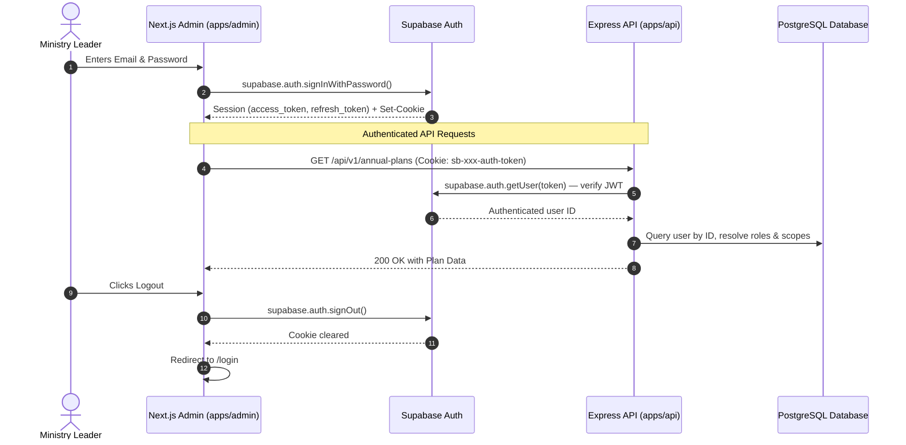

# API Authentication & Session Management

## Hitsanat Kifl Children's Ministry Management System
**Document Version:** 3.0  
**Authentication Provider:** Supabase Auth (GoTrue)  

---

## 1. Authentication Endpoints

| Endpoint | Method | Description | Auth Source | Status Codes |
| :--- | :---: | :--- | :--- | :---: |
| `/api/v1/auth/session` | `GET` | Get current user with roles & scopes | Supabase JWT (cookie/header) | `200 OK`<br>`401 Unauthorized` |
| `/api/v1/auth/sign-out` | `POST` | Client-side sign out (compatibility endpoint) | None | `200 OK` |

> **Note:** Sign-in is handled directly by Supabase Auth on the client side (`supabase.auth.signInWithPassword()`), not through the Express API.

---

## 2. Session Lifecycle



---

## 3. Regular Member Denial Policy (ADR-0007)

The RouteGuard component checks the user's roles after session validation. If the user does not hold at least one leadership role (`CHAIRPERSON`, `SUB_CHAIRPERSON`, `SECRETARY`, `SUPER_ADMIN`, or a sub-department `LEAD`/`ADMIN` role), access is denied:

```json
{
  "success": false,
  "error": {
    "code": "AUTH_UNAUTHORIZED",
    "message": "Access restricted. Regular members interact via the public portfolio website and Telegram."
  }
}
```
