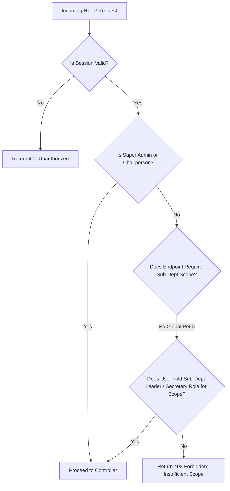

# API Authorization & Scoped Middleware

## Hitsanat Kifl Children's Ministry Management System
**Document Version:** 2.1  
**RBAC Strategy:** Scoped Role-Based Access Control (ADR-0005)  

---

## 1. Scoped Permission Architecture

The authorization middleware verifies access by checking both **Global System Roles** and **Sub-Department Scopes**.



---

## 2. Middleware Declarations & Usage

### 2.1 `requireAuth`
Extracts and verifies the Supabase JWT session token from cookies or `Authorization: Bearer` headers. Attaches `req.user` to the Express Request context:

```typescript
export interface RequestUser {
  id: string;
  email: string;
  globalRoles: ('SUPER_ADMIN' | 'CHAIRPERSON' | 'SUB_CHAIRPERSON' | 'SECRETARY')[];
  subDeptRoles: {
    subDepartmentCode: 'TIMIHRT' | 'MEZMUR' | 'KUTITR' | 'EKD' | 'KINETIBEB';
    role: 'Leader' | 'Sub-Leader' | 'Secretary' | 'Member';
  }[];
}
```

### 2.2 `requireScopePermission`
Enforces fine-grained permission guards:
```typescript
import { Router } from 'express';
import { requireAuth, requireScopePermission } from '@repo/auth';

const router = Router();

// Timihrt teacher assignment (restricted to Timihrt leadership or Executive Chair)
router.post(
  '/curriculum/assign-teacher',
  requireAuth,
  requireScopePermission({
    allowedGlobalRoles: ['SUPER_ADMIN', 'CHAIRPERSON'],
    requiredSubDeptCode: 'TIMIHRT',
    allowedSubDeptRoles: ['Leader', 'Sub-Leader']
  }),
  timihrtController.assignTeacher
);
```

### 2.3 Temporary grant fallback (BR-035 / ADR-0019)
When `resource` and `action` are both provided and role/sub-department checks fail, the middleware looks up an active `permission_grants` row for that user + resource + action (non-revoked, unexpired). On success it sets `req.permissionGrantUsed = true` and calls `next()`; on miss or DB error it returns `403 FORBIDDEN_INSUFFICIENT_SCOPE` (fail closed). Guards declared **without** `resource`/`action` remain synchronous (role-only).

```typescript
// apps/api member registration — grant fallback enables members:C when Secretary is unavailable
memberRouter.post(
  '/stage1',
  requireScopePermission({
    allowedGlobalRoles: ['CHAIRPERSON', 'SUB_CHAIRPERSON', 'SECRETARY'],
    resource: 'members',
    action: 'C',
  }),
  createStage1
);
```

### 2.4 Permission-grant management endpoints
| Method | Path | Access | Notes |
| :--- | :--- | :--- | :--- |
| `POST` | `/api/v1/permission-grants` | SUPER_ADMIN only | Body: `userId`, `resource`, `action`, `expiresAt`, optional `reason`. Validates BR-035 (future, ≤7 days). |
| `GET` | `/api/v1/permission-grants?userId=` | SUPER_ADMIN only | List grants for a user (or all). |
| `POST` | `/api/v1/permission-grants/:id/revoke` | SUPER_ADMIN only | Early revoke; `409` if already revoked; audited. |
