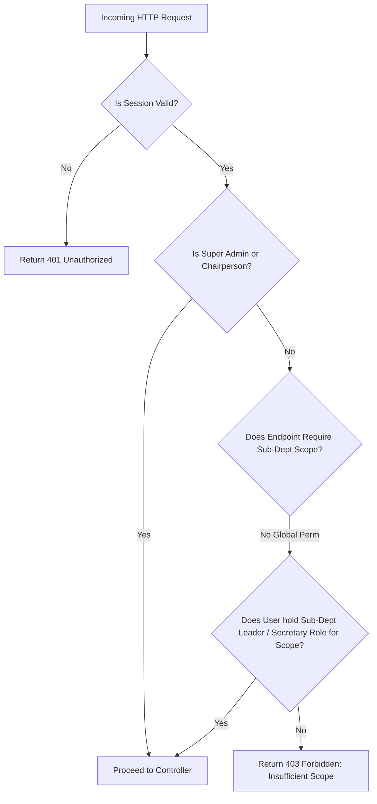

# API Authorization & Scoped Middleware

## Hitsanat Kifl Children's Ministry Management System
**Document Version:** 2.1  
**RBAC Strategy:** Scoped Role-Based Access Control (ADR-0005)  

---

## 1. Scoped Permission Architecture

The authorization middleware verifies access by checking both **Global System Roles** and **Sub-Department Scopes**.



---

## 2. Middleware Declarations & Usage

### 2.1 `requireAuth`
Extracts and verifies the Better Auth session token from cookies or `Authorization: Bearer` headers. Attaches `req.user` to the Express Request context:

```typescript
export interface RequestUser {
  id: string;
  email: string;
  globalRoles: ('SUPER_ADMIN' | 'CHAIRPERSON' | 'SUB_CHAIRPERSON' | 'SECRETARY')[];
  subDeptRoles: {
    subDepartmentCode: 'TIMIHRT' | 'MEZMUR' | 'KUTITR' | 'EKD' | 'KINETIBEB';
    role: 'Leader' | 'Sub-Leader' | 'Secretary' | 'Member';
  }[];
}
```

### 2.2 `requireScopePermission`
Enforces fine-grained permission guards:
```typescript
import { Router } from 'express';
import { requireAuth, requireScopePermission } from '@hitsanat/auth';

const router = Router();

// Timihrt teacher assignment (restricted to Timihrt leadership or Executive Chair)
router.post(
  '/curriculum/assign-teacher',
  requireAuth,
  requireScopePermission({
    allowedGlobalRoles: ['SUPER_ADMIN', 'CHAIRPERSON'],
    requiredSubDeptCode: 'TIMIHRT',
    allowedSubDeptRoles: ['Leader', 'Sub-Leader']
  }),
  timihrtController.assignTeacher
);
```
