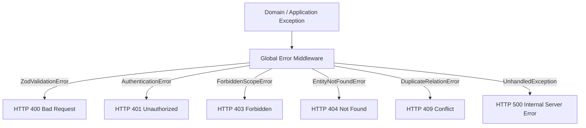

# API Error Handling & Taxonomy

## Hitsanat Kifl Children's Ministry Management System
**Document Version:** 2.1  
**Standard:** RFC 7807 (Problem Details for HTTP APIs)  

---

## 1. Error Taxonomy & Status Code Mapping



---

## 2. Standardized Error Codes Catalog

| Error Code | HTTP Status | Meaning / Trigger Scenario |
| :--- | :---: | :--- |
| `VALIDATION_FAILED` | `400` | Incoming JSON payload failed Zod schema checks. |
| `INVALID_ETHIOPIAN_DATE` | `400` | Provided Ethiopian date is mathematically invalid (e.g. Month 13, Day 7). |
| `AUTH_UNAUTHORIZED` | `401` | Missing, expired, or invalid session token. |
| `AUTH_NOT_AUTHORIZED_LEADERSHIP` | `403` | User is a regular member with no leadership credentials (ADR-0007). |
| `FORBIDDEN_INSUFFICIENT_SCOPE` | `403` | User holds a leadership role in Department A, but attempted an action in Department B. |
| `CHILD_NOT_FOUND` | `404` | Child ID does not exist. |
| `MEMBER_NOT_FOUND` | `404` | Member ID does not exist. |
| `PARENT_DUPLICATE_RELATION` | `409` | Child already has a Father or Mother linked (BR-010). |
| `DUPLICATE_PHONE_NUMBER` | `409` | Member phone number already registered. |
| `INTERNAL_SERVER_ERROR` | `500` | Uncaught system error; details sanitized in production. |

---

## 3. Global Express Error Handler Middleware

```typescript
import { Request, Response, NextFunction } from 'express';
import { ZodError } from 'zod';
import { DomainError } from '@hitsanat/domain';
import { logger } from '@hitsanat/logger';

export function globalErrorHandler(
  err: Error,
  req: Request,
  res: Response,
  next: NextFunction
) {
  logger.error({ err, path: req.path, method: req.method }, 'Unhandled error occurred');

  if (err instanceof ZodError) {
    return res.status(400).json({
      success: false,
      error: {
        code: 'VALIDATION_FAILED',
        message: 'Invalid request input data.',
        details: err.errors.map(e => ({
          field: e.path.join('.'),
          message: e.message
        }))
      },
      meta: { timestamp: new Date().toISOString() }
    });
  }

  if (err instanceof DomainError) {
    return res.status(err.httpStatus || 400).json({
      success: false,
      error: {
        code: err.code,
        message: err.message
      },
      meta: { timestamp: new Date().toISOString() }
    });
  }

  // Fallback for unexpected errors
  return res.status(500).json({
    success: false,
    error: {
      code: 'INTERNAL_SERVER_ERROR',
      message: process.env.NODE_ENV === 'production' 
        ? 'An unexpected error occurred. Please contact system support.' 
        : err.message
    },
    meta: { timestamp: new Date().toISOString() }
  });
}
```
