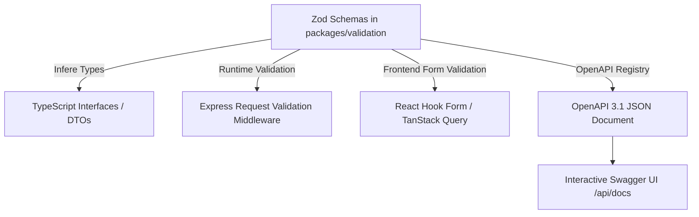

# OpenAPI 3.1 & Schema Contract Generation

## Hitsanat Kifl Children's Ministry Management System
**Document Version:** 2.1  
**Specification:** OpenAPI 3.1.0  
**Tooling:** `@asteasolutions/zod-to-openapi` via `packages/validation`  

---

## 1. Single-Source-of-Truth Contract Architecture

To ensure 100% synchronization between runtime validation, TypeScript types, and Swagger documentation, all data contracts originate from shared Zod schemas in `packages/validation`.



---

## 2. OpenAPI Registry Pattern

In each module, endpoints register their schemas using the central OpenAPI registry:

```typescript
import { OpenAPIRegistry } from '@asteasolutions/zod-to-openapi';
import { CreateMemberStage1Schema, MemberResponseSchema } from '@hitsanat/validation';

export const memberOpenApiRegistry = new OpenAPIRegistry();

memberOpenApiRegistry.registerPath({
  method: 'post',
  path: '/api/v1/members/stage-1',
  summary: 'Stage 1: Initial fast member creation by Secretary',
  tags: ['Members'],
  request: {
    body: {
      content: {
        'application/json': {
          schema: CreateMemberStage1Schema.openapi('CreateMemberStage1Input'),
        },
      },
    },
  },
  responses: {
    201: {
      description: 'Member created successfully in draft state',
      content: {
        'application/json': {
          schema: MemberResponseSchema.openapi('MemberResponse'),
        },
      },
    },
    400: { description: 'Validation failed' },
    401: { description: 'Unauthorized' },
    403: { description: 'Forbidden - Requires Secretary or Executive role' },
  },
});
```
