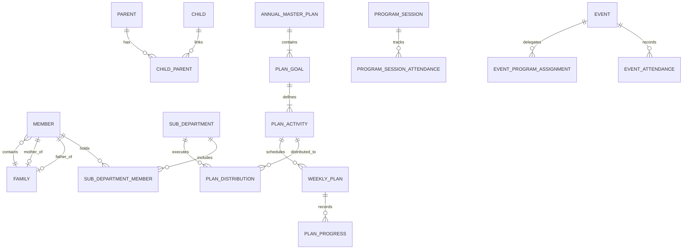

# Data Architecture & Storage Strategy

## Hitsanat Kifl Children's Ministry Management System
**Document Version:** 2.1  
**Database Engine:** PostgreSQL 15+ (Hosted on Supabase)  
**ORM & Query Builder:** Drizzle ORM  

---

## 1. Relational Data Modeling Philosophy

The data architecture balances normalized relational integrity with rapid querying and performance on free-tier PostgreSQL instances.

---

## 2. Core Storage Principles

### 2.1 Primary Keys & Identifier Strategy
- All primary keys use universally unique identifiers (`UUIDv4` or `gen_random_uuid()` in Postgres).
- Reason: Prevents enumeration attacks on child and member records, simplifies multi-environment seeding, and allows client-side ID generation where appropriate.

### 2.2 Date & Time Canonical Storage (ADR-0004)
- **Database Storage:** All dates and timestamps (`date`, `timestamp with time zone`) are persisted in canonical **Gregorian format in UTC (`TIMESTAMPTZ`)**.
- **Application Boundary:** The shared package `packages/calendar` (wrapping `ethiopian-calendar-new`) translates Gregorian timestamps into Ethiopian Calendar dates (e.g., Year 2016 E.C., Month *Tikimt*, Day 15) for frontend presentation and query filtering.

### 2.3 Separate Attendance Tables (ADR-0001)
To ensure strict foreign key integrity and prevent polymorphic table complexity:
- Weekly Saturday/Sunday program attendance is stored in `program_session_attendance`.
- Special feasts and extra training attendance is stored in `event_attendance`.

### 2.4 Referential Integrity & Delete Cascade Policies
- **Hard Cascade:** Deleting an Annual Master Plan cascades to its goals, activities, and quarterly breakdowns (in draft state).
- **Restrict / Nullify:** A Member cannot be hard-deleted if they are actively linked as a Father/Mother of a Family or referenced in historical attendance/exam records. Soft-archiving (`is_active = false`) is applied for graduated members (GC).
- **Parent-Child Cardinality:** Enforced via composite unique constraint: `UNIQUE(child_id, relation)` in the `child_parent` join table.

---

## 3. Database Migration & Schema Tooling

- Schema definitions are declared declaratively in TypeScript using Drizzle ORM (`packages/database/src/schema/*.ts`).
- Migrations are generated as immutable SQL scripts using `drizzle-kit generate` and applied via `drizzle-kit migrate`.
- Local development and CI run against disposable PostgreSQL Docker containers, ensuring identical schema states across environments.
