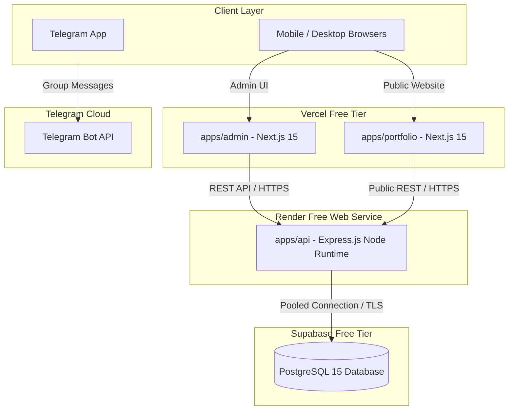

# Deployment Architecture & Infrastructure

## Hitsanat Kifl Children's Ministry Management System
**Document Version:** 2.1  
**Hosting Strategy:** Free-Tier Resilient Architecture (ADR-0017)  
**Portability Standard:** 100% Vendor-Decoupled Core  

---

## 1. Free-Tier Infrastructure Topology

The system is deployed across cost-effective, free-tier cloud platforms while remaining completely decoupled and portable.

---

## 2. Platform Allocations & Build Configurations

| Application / Service | Target Platform | Runtime / Build Command | Output Path | Public URL |
| :--- | :--- | :--- | :--- | :--- |
| `apps/admin` | **Vercel** | `pnpm --filter @hitsanat/admin build` | `.next` | `https://admin-hitsanat.vercel.app` |
| `apps/portfolio` | **Vercel** | `pnpm --filter @hitsanat/portfolio build` | `.next` | `https://hitsanat.vercel.app` |
| `apps/api` | **Render** | `pnpm --filter @hitsanat/api build` Start: `node apps/api/dist/server.js` | `apps/api/dist` | `https://api-hitsanat.onrender.com` |
| `apps/telegram` | **Open Decision** | Standalone Node Worker (See [Open Decisions](../open-decisions.md)) | `apps/telegram/dist` | Internal Service |
| Database | **Supabase** | Managed PostgreSQL with Drizzle Migrations | Standard Postgres Port 5432 / 6543 | Supabase Cloud |

---

## 3. Render Free-Tier Keep-Alive & Cold-Start Strategy

Render free web services spin down after 15 minutes of inactivity:
1. **Health Check Endpoint:** `apps/api` exposes a lightweight `GET /health` endpoint that checks database connectivity and returns `200 OK`.
2. **Uptime Ping Schedule:** A lightweight cron job or GitHub Actions workflow pings the `/health` endpoint every 10 minutes between 7:00 AM and 1:00 PM on Saturdays and Sundays (EAT), ensuring zero latency for ministry leaders during weekend operations.
3. **Frontend Graceful Retry:** TanStack Query on `apps/admin` is configured with exponential backoff and a visual "Waking up server..." indicator if the initial health response takes $> 5\text{ seconds}$.

---

## 4. Vendor Portability Guarantee

The core application code adheres to strict portability invariants:
- **No Vercel-Specific SDKs in Domain:** API routing and business logic do not rely on Vercel Serverless edge functions.
- **No Supabase Proprietary Locks:** Drizzle ORM queries use standard ANSI PostgreSQL; Row-Level Security (RLS) is not required since authorization is strictly handled by the Express application layer.
- **Migration Path:** The architecture can seamlessly lift-and-shift to a single VPS (e.g. Hetzner, DigitalOcean) running Docker Compose with zero codebase refactoring.
