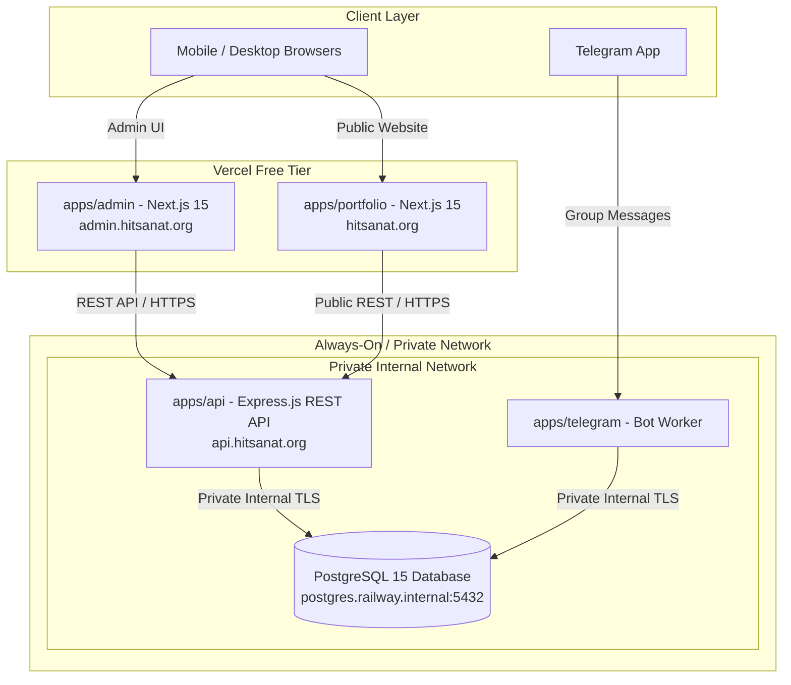

# Deployment Architecture & Infrastructure

## Hitsanat Kifl Children's Ministry Management System
**Document Version:** 2.2  
**Hosting Strategy:** Resilient Cloud Architecture (Vercel & Railway) (ADR-0017)  
**Portability Standard:** 100% Vendor-Decoupled Core  

---

## 1. Cloud Infrastructure Topology

The system is deployed across a high-performance, cost-effective cloud topology with 24/7 always-on uptime and private internal networking:

---

## 2. Platform Allocations & Build Configurations

| Application / Service | Target Platform | Runtime / Build Command | Output Path | Public URL |
| :--- | :--- | :--- | :--- | :--- |
| `apps/admin` | **Vercel** | `pnpm --filter @hitsanat/admin build` | `.next` | `https://admin.hitsanat.org` |
| `apps/portfolio` | **Vercel** | `pnpm --filter @hitsanat/portfolio build` | `.next` | `https://hitsanat.org` |
| `apps/api` | **Railway** | `pnpm install --frozen-lockfile && pnpm --filter @hitsanat/database db:migrate && pnpm --filter @hitsanat/api build` Start: `node apps/api/dist/server.js` | `apps/api/dist` | `https://api.hitsanat.org` |
| `apps/telegram` | **Railway** | `pnpm --filter @hitsanat/telegram build` Start: `node apps/telegram/dist/index.js` | `apps/telegram/dist` | Internal Private Worker |
| Database | **Railway** | Managed PostgreSQL 15 | Private Port 5432 | `postgres.railway.internal` |

---

## 3. High Availability & Always-On Operational Strategy

1. **Zero Cold Starts:** Railway runs services 24/7 without sleeping. Leaders accessing the portal at 7:30 AM on Saturdays experience immediate $<50\text{ ms}$ response times.
2. **Private Internal Networking:** Database and background worker traffic is routed strictly over internal hostnames (`postgres.railway.internal`), preventing public exposure and reducing latency.
3. **Automated Migration Pipeline:** Database migrations execute automatically during deployment before the updated API instance receives live traffic.

---

## 4. Vendor Portability Guarantee

The core application code adheres to strict portability invariants:
- **Standard Docker / Nixpacks Containers:** All backend services and frontend apps run standard Node.js processes.
- **Pure ANSI PostgreSQL:** Drizzle ORM queries use standard PostgreSQL without proprietary cloud locks.
- **Zero Lock-in:** The entire architecture can effortlessly migrate to a single self-hosted VPS (Docker Compose / Coolify) with zero codebase changes.
