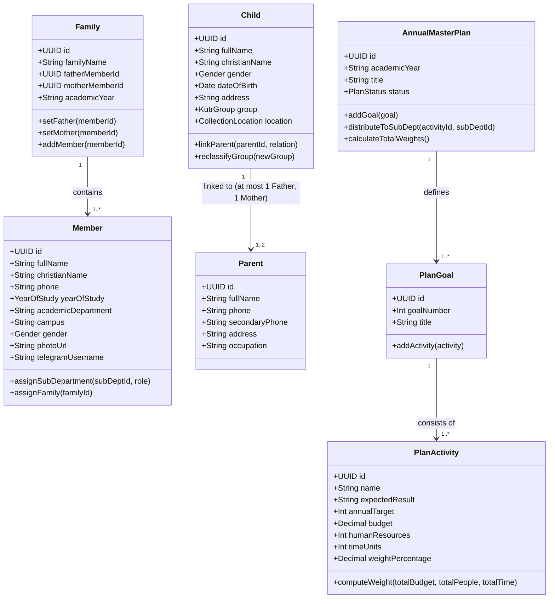

# Domain Model & Ubiquitous Language

## Hitsanat Kifl Children's Ministry Management System
**Document Version:** 2.1  
**Approach:** Tactical Domain-Driven Design (DDD)  

---

## 1. Ubiquitous Language (Domain Glossary)

| Term (English / Amharic) | Classification | Domain Definition |
| :--- | :--- | :--- |
| **Gibi Gubae** (ግቢ ጉባኤ) | Organization | The overarching Orthodox Tewahedo Student Association at Haramaya University. |
| **Hitsanat Kifl** (የህጻናት ክፍል) | Bounded Context | The Children's Ministry Department responsible for local children's spiritual education and care. |
| **Member** (አባል) | Entity | Active university student servant serving in leadership or operational ministry roles. |
| **Family** (ቤተሰብ) | Aggregate Root | Pastoral grouping of student members headed by one Father and one Mother. |
| **Father** (የቤተሰብ አባት) | Role / VO | Senior male member providing pastoral mentorship within a student Family. |
| **Mother** (የቤተሰብ እናት) | Role / VO | Senior female member providing pastoral mentorship within a student Family. |
| **Sub-Department** (ክፍል) | Entity / Scope | One of five specialized ministry branches: Timihrt, Mezmur, Kutitr, Ekd, Kinetibeb. |
| **Child** (ሕፃን) | Aggregate Root | Community child beneficiary receiving spiritual education and ministry care. |
| **Parent** (ወላጅ) | Entity | Biological or legal father/mother of enrolled children. |
| **Kutr 1 / Kutr 2** (ቁጥር 1 / ቁጥር 2) | Value Object | Child cohort classification based on developmental age and curriculum readiness. |
| **Collection Point** (መሰብሰቢያ ቦታ) | Value Object | One of five designated locations for gathering children on Saturday mornings: Apartama, Gende Boy, Gende Je, Cobalt, Bate. |
| **Mezmur Astegni** (መዝሙር አስተኚ) | Role / VO | Student choir conductor assigned to teach and lead liturgical hymns. |
| **Yeteret Abat** (የተረት አባት) | Program / VO | A structured moral and spiritual storytelling segment managed by Kinetibeb Kifl. |
| **Awdemerit** (ዓውደ ምህረት) | Event / Program | Monthly Sunday church event where children perform hymns before the full congregation. |
| **Annual Master Plan** (የዓመት ዕቅድ) | Aggregate Root | Master operational plan created by Ekd, distributed to sub-departments, and tracked via weight metrics. |
| **Plan Activity** (ዋና ተግባር) | Entity | A measurable activity under an annual goal with defined budget, people, time, and calculated weight. |
| **Plan Weight** (ክብደት) | Value Object | Relative percentage value derived from Budget, Human Resources, and Time allocations ($\sum = 100\%$). |

---

## 2. Domain Aggregates & Entity Model



---

## 3. Domain Services & Calculation Engines

### 3.1 Planning Weight Calculation Engine (`packages/domain/planning`)
The engine enforces the mathematical weight formula from the Action Plan:
```typescript
export function computeActivityWeight(
  budget: number,
  totalBudget: number,
  people: number,
  totalPeople: number,
  timeUnits: number,
  totalTime: number
): number {
  const budgetRatio = totalBudget > 0 ? (budget / totalBudget) * 100 : 0;
  const peopleRatio = totalPeople > 0 ? (people / totalPeople) * 100 : 0;
  const timeRatio = totalTime > 0 ? (timeUnits / totalTime) * 100 : 0;

  const rawWeight = (budgetRatio + peopleRatio + timeRatio) / 3;
  return Number(rawWeight.toFixed(4));
}
```

### 3.2 Attendance Seeding Domain Service (`packages/domain/attendance`)
When a program session or event assignment is confirmed, the domain raises `ActivityAssignedEvent`, and the `AttendanceSeedingService` seeds initial attendance records:
- Target Person: `Member` or `Child`
- Session Date: UTC Timestamp
- Initial Status: `Expected`
- Verified Status Transition: `Expected` $\rightarrow$ `Present` | `Absent` | `Excused` (recorded by Kutitr).
