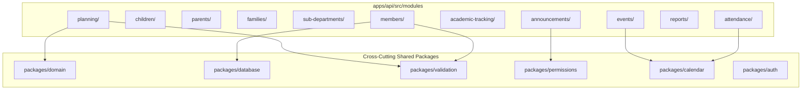

# Module Architecture & Vertical Slices

## Hitsanat Kifl Children's Ministry Management System
**Document Version:** 2.1  
**Backend Framework:** Express.js + TypeScript (ADR-0008)  

---

## 1. Modular Monolith Architecture

The backend application (`apps/api`) is structured into self-contained, feature-based modules located in `apps/api/src/modules/`. Each module encapsulates its domain logic, application use cases, infrastructure adapters, and presentation routers.



---

## 2. Standard Module Directory Structure

Every business module follows an identical internal 4-tier layer structure:

```text
apps/api/src/modules/<module-name>/
├── domain/                  # Entities, Value Objects, Domain Events, Domain Exceptions
│   ├── entities/
│   ├── events/
│   └── repositories/        # Repository Interfaces
│
├── application/             # Use Cases, Command/Query Handlers, DTOs
│   ├── use-cases/
│   ├── dtos/
│   └── mappers/
│
├── infrastructure/          # Drizzle implementations, external adapters
│   └── repositories/        # Concrete Drizzle ORM Repositories
│
├── presentation/            # Express controllers, routers, request validation
│   ├── <module>.controller.ts
│   ├── <module>.routes.ts
│   └── <module>.openapi.ts  # Route-level OpenAPI/Swagger definitions
│
└── index.ts                 # Module public contract export
```

---

## 3. Inter-Module Communication Rules

1. **In-Process Method Calls via Application Services:** Modules may directly call public application service methods or use cases exposed by other modules through their top-level `index.ts`.
2. **Asynchronous Decoupling via Domain Events:** Cross-cutting side effects (such as auto-seeding attendance records when an event is scheduled, or notifying the Telegram bot when an announcement is published) are triggered via an in-memory event bus or transactional outbox.
3. **No Direct Presentation-to-Presentation Coupling:** A controller in `planning/` must never import a controller from `attendance/`. Communication must occur at the Application/Domain layer.
4. **Shared Database Schema Centralization:** All Drizzle table schemas reside in `packages/database/src/schema/` to ensure atomic migrations, while repository access remains strictly encapsulated inside each module's infrastructure layer.
