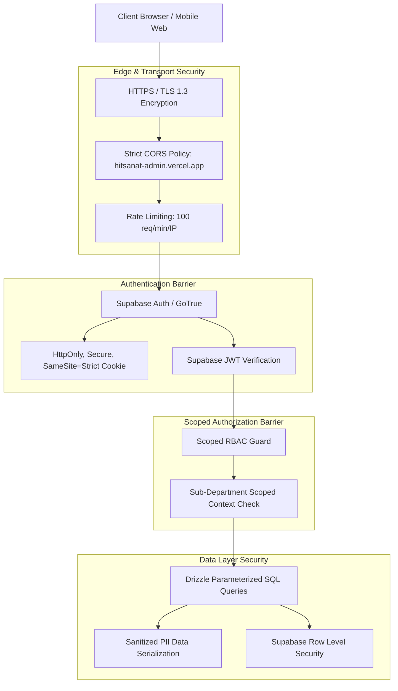

# Security Architecture & Access Control

## Hitsanat Kifl Children's Ministry Management System
**Document Version:** 3.0  
**Auth Provider:** Supabase Auth  
**Access Model:** Scoped Role-Based Access Control (RBAC)  

---

## 1. Security Architecture & Threat Model



---

## 2. Authentication & Session Management

- **Authentication Provider:** **Supabase Auth** (GoTrue) — manages user accounts, password hashing (bcrypt), JWT tokens, and session lifecycle.
- **Session Tokens:** Supabase sets an `HttpOnly`, `Secure`, `SameSite=Strict` cookie (`sb-<project-ref>-auth-token`). No raw authentication tokens are stored in browser `localStorage` or `sessionStorage`.
- **JWT Verification:** The Express API verifies Supabase JWTs using `supabase.auth.getUser()` (server-side verification against Supabase auth server).
- **Session Duration:** Managed by Supabase (default 1 week, refresh token rotation).

---

## 3. Scoped Authorization & Least Privilege

### 3.1 Non-Leadership Zero-Access Boundary (ADR-0007)
Regular members (`MEMBER_REGULAR`) without active leadership appointments have **no login credentials** in Supabase Auth. The RouteGuard component rejects non-leadership users at the frontend level.

### 3.2 Department Scope Isolation (ADR-0005)
Permissions are enforced at the API route handler level using scoped guards:

```typescript
router.post(
  '/curriculum',
  requireAuth(),
  requireScopePermission({ requiredSubDeptCode: 'TIMIHRT', allowedSubDeptRoles: ['Leader', 'Sub-Leader'] }),
  timihrtController.createCurriculumItem
);
```

### 3.3 Temporary Permission Grants (BR-035 / ADR-0019)
When a role holder is temporarily unavailable, `SUPER_ADMIN` may issue a single `resource`+`action` grant (max 7 days, early-revocable, audited). `requireScopePermission({ resource, action, … })` consults active grants only after role/scope checks fail and marks `req.permissionGrantUsed`. Unbound guards stay synchronous; grant lookup is fail-closed.

---

## 4. Beneficiary Data Privacy & Child Protection

1. **Child & Parent Data Isolation:** Public endpoints expose zero PII. Only aggregated numerical metrics are accessible without authentication.
2. **Contact Detail Redaction:** Phone numbers and residential addresses are restricted to the Secretary, Chairperson, and Kutitr transportation coordinators.
3. **Audit Trail Logging:** All write, update, and delete actions are recorded in the `audit_log` table.
