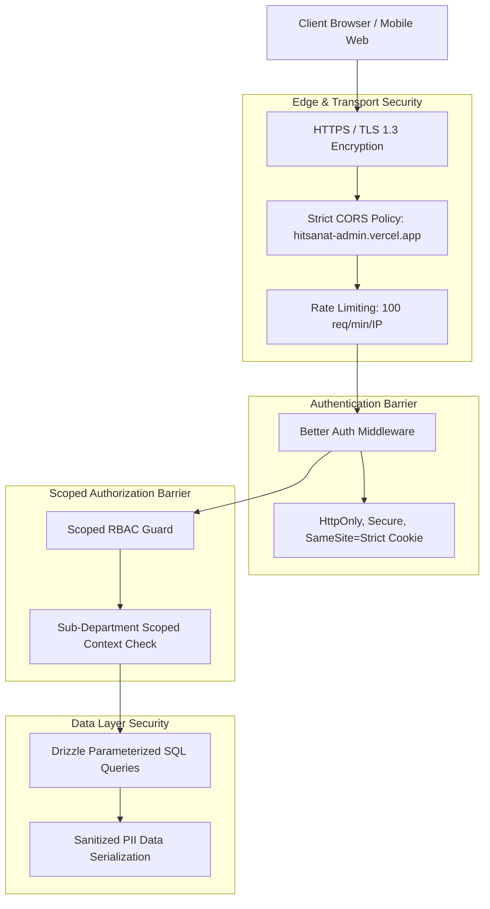

# Security Architecture & Access Control

## Hitsanat Kifl Children's Ministry Management System
**Document Version:** 2.1  
**Auth Provider:** Better Auth  
**Access Model:** Scoped Role-Based Access Control (RBAC)  

---

## 1. Security Architecture & Threat Model



---

## 2. Authentication & Session Management

- **Authentication Framework:** **Better Auth** (`packages/auth`), providing robust session storage, secure password hashing (`argon2id` / `bcrypt`), and CSRF token verification.
- **Session Tokens:** Transmitted via `httpOnly`, `Secure`, `SameSite=Strict` browser cookies. No raw authentication tokens are stored in browser `localStorage` or `sessionStorage` to mitigate Cross-Site Scripting (XSS) token theft.
- **Session Duration:** 7 days rolling expiration, with automatic invalidation upon password reset or administrative role revocation.

---

## 3. Scoped Authorization & Least Privilege

### 3.1 Non-Leadership Zero-Access Boundary (ADR-0007)
Regular members (`MEMBER_REGULAR`) without active leadership appointments have **no login accounts** or credentials in the system. Any attempt to authenticate without a leadership role is rejected with `HTTP 403 Forbidden` and `AUTH_NOT_AUTHORIZED_LEADERSHIP`.

### 3.2 Department Scope Isolation (ADR-0005)
Permissions are enforced at the API route handler level using scoped guards:

```typescript
// Example: Scoped Authorization in Express Router
router.post(
  '/curriculum',
  requireAuth(),
  requireScopePermission('TIMIHRT', 'CURRICULUM_CREATE'),
  timihrtController.createCurriculumItem
);
```

If a user holding `SUB_LEAD_MEZMUR` attempts to access `/api/v1/timihrt/curriculum`, the guard detects the mismatch between the user's active sub-department scope (`MEZMUR`) and the required scope (`TIMIHRT`), immediately terminating the request.

---

## 4. Beneficiary Data Privacy & Child Protection

1. **Child & Parent Data Isolation:** Public endpoints (consumed by `apps/portfolio`) expose zero PII. Only aggregated numerical metrics (e.g., total count of children, total events completed) are accessible without authentication.
2. **Contact Detail Redaction:** Phone numbers and residential addresses of children and parents are restricted to the Secretary, Chairperson, and Kutitr transportation coordinators.
3. **Audit Trail Logging:** All write, update, and delete actions on child and member records are recorded in the `audit_log` table, logging the operator's user ID, IP address, timestamp, and JSON diff of changes.
