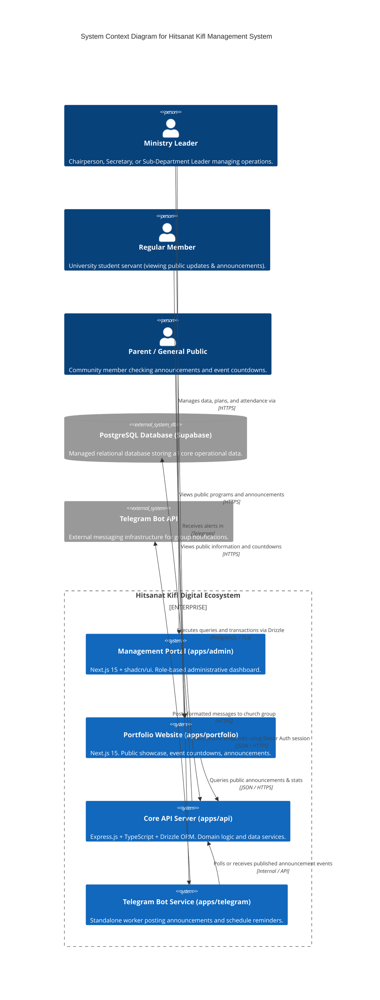
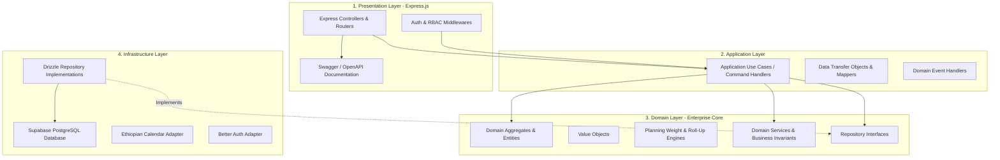

# System Architecture Document

## Hitsanat Kifl Children's Ministry Management System
**Document Version:** 2.1  
**Architecture Patterns:** Modular Monolith, Domain-Driven Design (DDD), Clean Architecture, Feature-Based Modules  

---

## 1. High-Level Architectural Context (C4 Context Diagram)



---

## 2. Monorepo Repository Structure (Turborepo & pnpm)

The codebase is organized as a Turborepo monorepo with strict package boundaries:

```text
Hitsanat/
├── apps/
│   ├── admin/               # Next.js 15 Admin Portal (Leadership only)
│   ├── api/                 # Express.js + TypeScript Backend Service
│   ├── portfolio/           # Next.js 15 Public Showcase Website
│   └── telegram/            # Standalone Telegram Bot Notification Service
│
├── packages/
│   ├── auth/                # Better Auth configuration and session guards
│   ├── calendar/            # Ethiopian Calendar conversion (ethiopian-calendar-new)
│   ├── config/              # Shared TypeScript & Biome configuration
│   ├── database/            # Drizzle ORM schema declarations & migrations
│   ├── domain/              # Core business entities, value objects & calculation engines
│   ├── logger/              # Structured logging utility
│   ├── permissions/         # Scoped RBAC matrices, constants & evaluation helpers
│   ├── ui/                  # Shared shadcn/ui components (Preset: b1D0f7S7)
│   └── validation/          # Shared Zod schemas and API request/response contracts
│
├── docs/                    # Complete Technical Documentation System
├── turbo.json               # Monorepo task pipeline configuration
├── biome.json               # Code formatting, linting & import rules
├── docker-compose.yml       # Local PostgreSQL development container
└── package.json             # Root workspace configuration
```

---

## 3. Clean Architecture Layering in `apps/api`

The backend follows Clean Architecture principles, ensuring that business logic remains independent of frameworks, databases, and UI components:



### Layer Responsibilities:
1. **Domain Layer (`packages/domain` & `apps/api/src/modules/*/domain`):**
   - Contains pure TypeScript business logic, entities, value objects, and domain exceptions.
   - Zero external framework dependencies (no Express, no Drizzle imports in domain logic).
2. **Application Layer (`apps/api/src/modules/*/application`):**
   - Coordinates use cases, transaction orchestration, domain event publishing, and DTO transformations.
3. **Infrastructure Layer (`apps/api/src/modules/*/infrastructure` & `packages/database`):**
   - Implements repository interfaces using Drizzle ORM, executes database transactions, handles external network services.
4. **Presentation Layer (`apps/api/src/modules/*/presentation`):**
   - Express route handlers, input validation via Zod, HTTP status code mapping, Swagger/OpenAPI docs generation.
