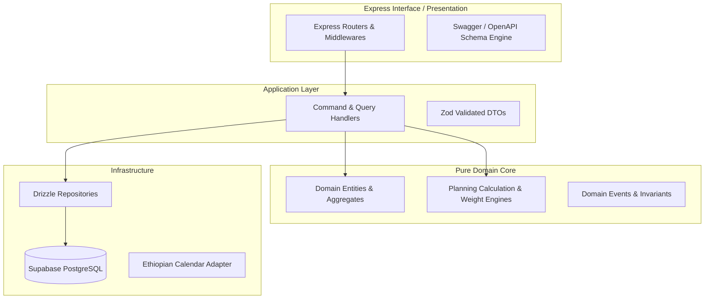

# Backend Architecture Specification

## Hitsanat Kifl Children's Ministry Management System
**Document Version:** 2.1  
**Framework:** Express.js + TypeScript (ADR-0008)  
**Database Tooling:** Drizzle ORM + PostgreSQL  

---

## 1. Clean Architecture & Modular Monolith

The backend application (`apps/api`) encapsulates all domain business logic inside clean, decoupled layers:

### Core Invariant:
Business rules and domain engines never import Express, HTTP request objects, or database-specific query builders directly. They operate on pure TypeScript domain models.
