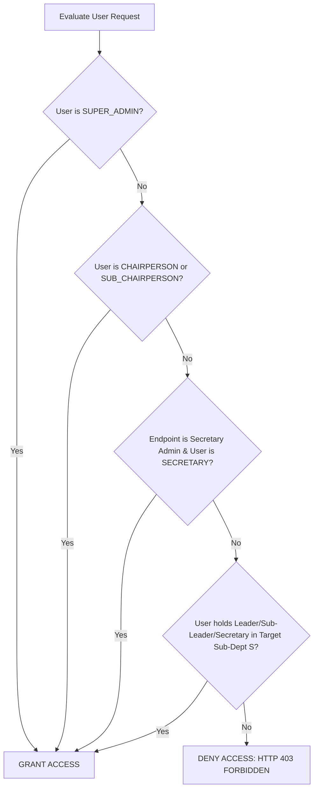

# Backend Authorization & Scoped RBAC Engine

## Hitsanat Kifl Children's Ministry Management System
**Document Version:** 2.1  
**Architecture ADR:** Scoped RBAC Tables (ADR-0005)  

---

## 1. Scoped Role Evaluation Algorithm

When an authenticated user invokes an endpoint requiring permissions on resource $R$ within sub-department scope $S$:



---

## 2. Reusable Guard Middleware

```typescript
import { Request, Response, NextFunction } from 'express';

export function requireScopePermission(options: {
  allowedGlobalRoles?: string[];
  requiredSubDeptCode?: string;
  allowedSubDeptRoles?: string[];
}) {
  return (req: Request, res: Response, next: NextFunction) => {
    const user = req.user;
    if (!user) {
      return res.status(401).json({ success: false, error: { code: 'AUTH_UNAUTHORIZED', message: 'Authentication required' } });
    }

    // 1. Check Global Executive Roles
    if (user.globalRoles.includes('SUPER_ADMIN')) return next();
    if (options.allowedGlobalRoles && options.allowedGlobalRoles.some(r => user.globalRoles.includes(r as any))) {
      return next();
    }

    // 2. Check Sub-Department Scoped Role
    if (options.requiredSubDeptCode) {
      const match = user.subDeptRoles.find(r => r.subDepartmentCode === options.requiredSubDeptCode);
      if (match && (!options.allowedSubDeptRoles || options.allowedSubDeptRoles.includes(match.role))) {
        return next();
      }
    }

    return res.status(403).json({
      success: false,
      error: {
        code: 'FORBIDDEN_INSUFFICIENT_SCOPE',
        message: 'You do not have permission to perform this action in this sub-department scope.'
      }
    });
  };
}
```

---

## 3. Implementation Details

### 3.1 packages/permissions

The RBAC system is implemented as a dedicated package:

| File | Purpose |
| :--- | :--- |
| `packages/permissions/src/types.ts` | `GlobalRole` enum (SUPER_ADMIN, CHAIRPERSON, SUB_CHAIRPERSON, SECRETARY, MEMBER_REGULAR), `ResourceType` enum, `ActionType` enum, `SubDepartmentCode` enum |
| `packages/permissions/src/matrix.ts` | `PERMISSION_MATRIX` record mapping `GlobalRole` to `Permission[]` arrays |
| `packages/permissions/src/checker.ts` | `hasGlobalPermission()`, `hasSubDeptPermission()`, `checkPermission()` functions |
| `packages/permissions/src/leadership.ts` | BR-009 One Leadership Post Rule validation |
| `packages/permissions/src/sub-dept-permissions.ts` | Sub-department scoped permission evaluation |

### 3.2 packages/auth

The auth middleware wraps permission checks:

| File | Purpose |
| :--- | :--- |
| `packages/auth/src/index.ts` | `requireAuth` (JWT verification), `requireScopePermission` (RBAC evaluation) |

### 3.3 BR-008 Enforcement

User management endpoints are restricted to `SUPER_ADMIN` and `CHAIRPERSON`:

```typescript
// apps/api/src/modules/users/presentation/users.router.ts
router.use(requireScopePermission({ allowedGlobalRoles: ['SUPER_ADMIN', 'CHAIRPERSON'] }));

// apps/api/src/modules/audit/presentation/audit.router.ts
router.use(requireScopePermission({ allowedGlobalRoles: ['SUPER_ADMIN', 'CHAIRPERSON'] }));
```

### 3.4 Super Admin Bypass

The `SUPER_ADMIN` role bypasses all permission checks. This is a design decision: Super Admin has unrestricted access to all resources and actions. Implementation:
- `packages/permissions/src/checker.ts`: `if (role === GlobalRole.SUPER_ADMIN) return true;`
- `packages/auth/src/index.ts`: `if (user.globalRoles.includes('SUPER_ADMIN')) return next();`
