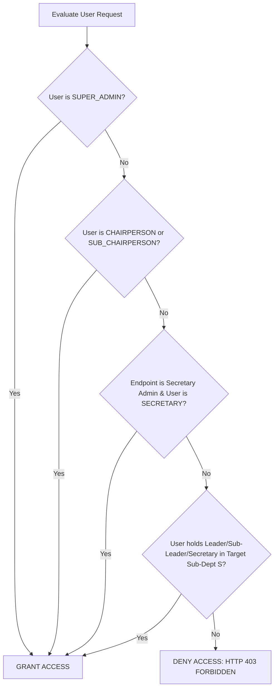

# Backend Authorization & Scoped RBAC Engine

## Hitsanat Kifl Children's Ministry Management System
**Document Version:** 2.1  
**Architecture ADR:** Scoped RBAC Tables (ADR-0005)  

---

## 1. Scoped Role Evaluation Algorithm

When an authenticated user invokes an endpoint requiring permissions on resource $R$ within sub-department scope $S$:



---

## 2. Reusable Guard Middleware

```typescript
import { Request, Response, NextFunction } from 'express';

export function requireScopePermission(options: {
  allowedGlobalRoles?: string[];
  requiredSubDeptCode?: string;
  allowedSubDeptRoles?: string[];
}) {
  return (req: Request, res: Response, next: NextFunction) => {
    const user = req.user;
    if (!user) {
      return res.status(401).json({ success: false, error: { code: 'AUTH_UNAUTHORIZED', message: 'Authentication required' } });
    }

    // 1. Check Global Executive Roles
    if (user.globalRoles.includes('SUPER_ADMIN')) return next();
    if (options.allowedGlobalRoles && options.allowedGlobalRoles.some(r => user.globalRoles.includes(r as any))) {
      return next();
    }

    // 2. Check Sub-Department Scoped Role
    if (options.requiredSubDeptCode) {
      const match = user.subDeptRoles.find(r => r.subDepartmentCode === options.requiredSubDeptCode);
      if (match && (!options.allowedSubDeptRoles || options.allowedSubDeptRoles.includes(match.role))) {
        return next();
      }
    }

    return res.status(403).json({
      success: false,
      error: {
        code: 'FORBIDDEN_INSUFFICIENT_SCOPE',
        message: 'You do not have permission to perform this action in this sub-department scope.'
      }
    });
  };
}
```
