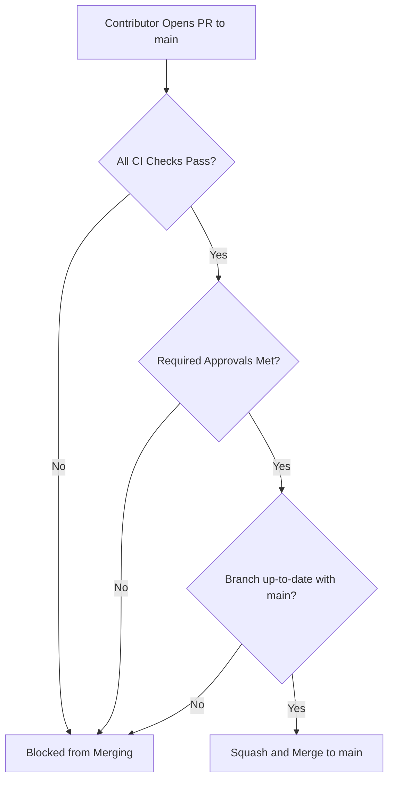

# CI/CD: Branch Protection & Merge Policies

## Hitsanat Kifl Children's Ministry Management System
**Document Version:** 2.1  
**Protected Branch:** `main`  

---

## 1. GitHub Repository Protection Rules

The `main` branch is permanently protected to ensure that production code remains deployable at all times.

---

## 2. Mandatory Branch Protection Settings

1. **Require a Pull Request before merging:** Direct pushes to `main` are strictly blocked for all users (including repository admins).
2. **Require Approvals:** At least 1 approving review from the assigned codeowner/lead.
3. **Dismiss stale pull request approvals when new commits are pushed:** Enabled.
4. **Require Status Checks to Pass before Merging:**
   - `Lint, Typecheck & Test Suite`
   - `Playwright E2E & Accessibility Tests`
5. **Require branches to be up to date before merging:** Enabled (Strict mode).
6. **Do not allow bypassing the above settings:** Enforced for all contributors.
7. **Allow Force Pushes:** Strictly Disabled.
8. **Allow Deletions:** Strictly Disabled.
