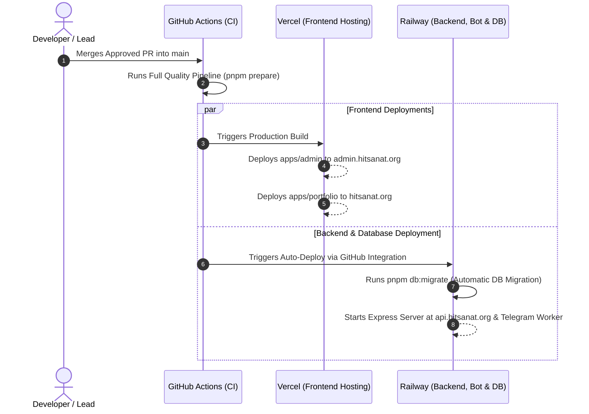

# CI/CD: Continuous Deployment & Release Pipeline

## Hitsanat Kifl Children's Ministry Management System
**Document Version:** 2.2  

---

## 1. Automated Continuous Deployment Flow

---

## 2. Preview Environments & Rollback Safety
- **Vercel Previews:** Every Pull Request automatically receives isolated preview URLs for `apps/admin` and `apps/portfolio` to facilitate UI review.
- **Railway Ephemeral PR Environments:** Railway automatically provisions isolated preview backend containers if required for complex feature testing.
- **Rollback Strategy:** Both Vercel and Railway provide instant 1-click rollbacks to the last known healthy deployment if runtime regressions occur.
