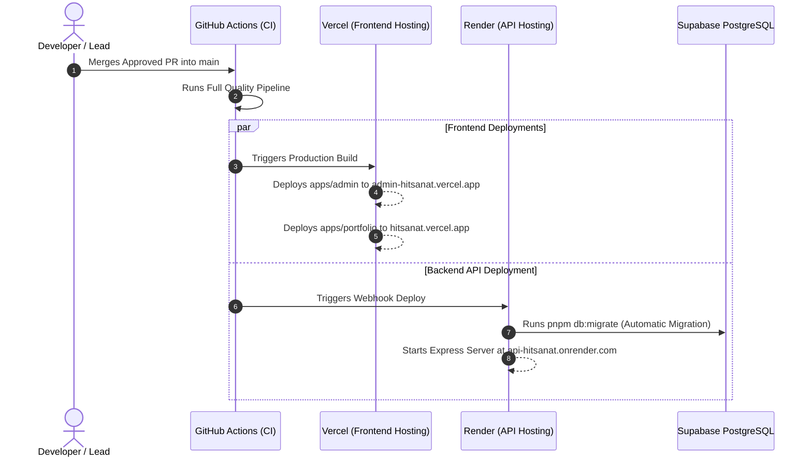

# CI/CD: Continuous Deployment & Release Pipeline

## Hitsanat Kifl Children's Ministry Management System
**Document Version:** 2.1  

---

## 1. Automated Continuous Deployment Flow

---

## 2. Preview Environments
- **Vercel Previews:** Every Pull Request automatically receives isolated preview URLs for `apps/admin` and `apps/portfolio` to facilitate visual review.
- **Rollback Strategy:** Vercel and Render provide instant 1-click rollbacks to the last known healthy deployment if runtime regressions occur.
