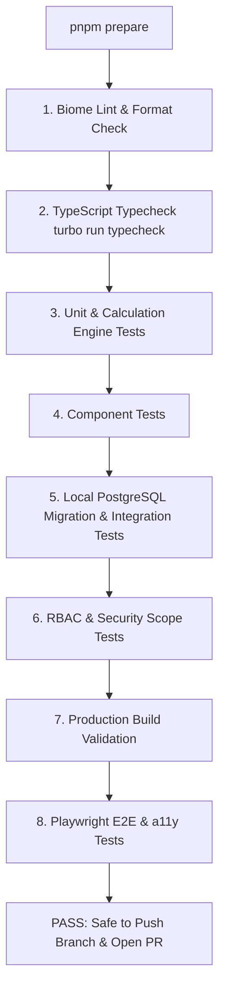

# CI/CD: Local CI Quality Gate (`pnpm prepare`)

## Hitsanat Kifl Children's Ministry Management System
**Document Version:** 2.1  
**Architecture ADR:** Local CI Quality Gate (ADR-0015)  

---

## 1. The `pnpm prepare` Command Contract

To prevent broken code from being pushed to remote branches and wasting CI minutes, every contributor **MUST** run the local CI verification pipeline before pushing:

```bash
pnpm prepare
```



---

## 2. Granular Diagnostic Commands

Contributors can also run individual verification steps during active development:

| Command | Action |
| :--- | :--- |
| `pnpm lint` | Runs Biome linter and formatter checks |
| `pnpm lint:fix` | Automatically formats files and fixes mechanical lint issues |
| `pnpm typecheck` | Validates TypeScript types across all apps and packages |
| `pnpm test:unit` | Runs fast in-memory unit tests |
| `pnpm test:integration` | Runs integration tests against local Docker PostgreSQL |
| `pnpm test:e2e` | Executes Playwright end-to-end tests |
| `pnpm build` | Validates production bundle compilation |
