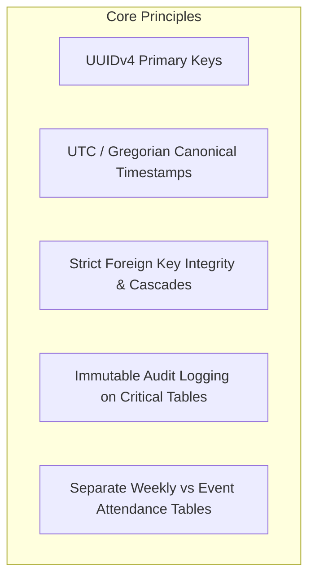

# Database Design & Modeling Philosophy

## Hitsanat Kifl Children's Ministry Management System
**Document Version:** 2.1  
**Database Engine:** PostgreSQL 15+  
**ORM Tooling:** Drizzle ORM (`packages/database`)  

---

## 1. Relational Architecture Principles

### Key Architectural Guidelines:
1. **Naming Conventions:** 
   - Table names use `snake_case` plural (e.g., `members`, `children`, `families`, `annual_plans`).
   - Column names use `snake_case` (e.g., `christian_name`, `date_of_birth`, `created_at`).
   - Foreign key columns use `<singular_table>_id` (e.g., `family_id`, `child_id`).
2. **Primary Keys:**
   - All primary keys are `UUID` types with default generation `defaultRandom()` (`gen_random_uuid()`).
3. **Timestamp Tracking:**
   - Every entity includes `created_at` (`TIMESTAMPTZ`, default `now()`) and `updated_at` (`TIMESTAMPTZ`, default `now()`).
4. **Soft Deletion vs Active Status:**
   - Critical ministry records (members, children) use `is_active` (`BOOLEAN`, default `true`) or status enums rather than hard deletions, preserving historical attendance and test records.
5. **Gregorian Date Storage:**
   - In accordance with ADR-0004, all dates are stored as standard Gregorian `DATE` or `TIMESTAMPTZ`. Ethiopian calendar dates are derived dynamically at runtime.

---

## 2. Table Classification Taxonomy

The database schema is organized into 5 logical clusters:
1. **Identity & Governance:** `users`, `sessions`, `accounts`, `members`, `sub_departments`, `sub_department_members`, `families`.
2. **Beneficiaries:** `children`, `parents`, `child_parents`.
3. **Attendance & Logistics:** `collection_locations`, `program_sessions`, `program_session_assignments`, `program_session_attendance`, `events`, `event_assignments`, `event_attendance`.
4. **Academic & Education:** `timihrt_curriculums`, `academic_assessments`, `student_scores`.
5. **Planning & Strategy:** `annual_master_plans`, `plan_goals`, `plan_activities`, `plan_distributions`, `quarterly_plans`, `monthly_plans`, `weekly_plans`, `plan_progress_records`.
6. **Outreach & Communication:** `announcements`, `announcement_targets`, `audit_logs`.
