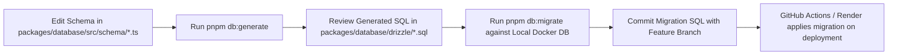

# Database Migration & Seeding Strategy

## Hitsanat Kifl Children's Ministry Management System
**Document Version:** 2.1  
**Tooling:** Drizzle Kit (`pnpm drizzle-kit`)  

---

## 1. Migration Workflow & Pipeline



### 1.1 Key Commands
```bash
# Generate SQL migration file from Drizzle schema diff
pnpm --filter @hitsanat/database db:generate

# Apply pending migrations to the active database
pnpm --filter @hitsanat/database db:migrate

# Open Drizzle Studio for visual database inspection
pnpm --filter @hitsanat/database db:studio
```

---

## 2. Seed Data Strategy

### 2.1 Reference Data Seeding (`packages/database/src/seed/reference-data.ts`)
The seed script idempotently initializes:
1. **The 5 Fixed Sub-Departments:** `TIMIHRT`, `MEZMUR`, `KUTITR`, `EKD`, `KINETIBEB`.
2. **The 5 Collection Locations:** `Apartama`, `Gende Boy`, `Gende Je`, `Cobalt`, `Bate`.
3. **The 2 Child Groups:** `Kutr 1`, `Kutr 2`.
4. **Initial Super Admin Account:** Provisioned securely with Better Auth.

### 2.2 Action PLN Reference Master Plan Seeding
The 2016 E.C. Action Plan (`Action PLN.xlsx`) is seeded as the canonical initial master plan template:
- Master Plan: `የ2016 ዓ.ም. ዕቅድ ትግበራ`
- Total Budget: `3500.00 ETB`
- Total Human Resources: `112 units`
- Total Time: `45 units`
- Goals: 6 Master Goals
- Activities: 25 Normalized Activities with pre-calculated weights summing to `100.0%`.
