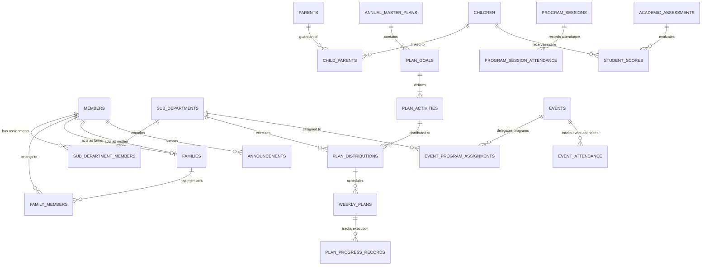

# Database Relationships & ERD

## Hitsanat Kifl Children's Ministry Management System
**Document Version:** 2.1  
**Target Database:** PostgreSQL 15+  

---

## 1. Complete Entity Relationship Diagram (ERD)

---

## 2. Key Foreign Key Cardinalities & Behaviors

| Parent Table | Child Table | Foreign Key Column | Cardinality | ON DELETE Action | Rationale |
| :--- | :--- | :--- | :---: | :--- | :--- |
| `members` | `sub_department_members` | `member_id` | $1:N$ | `CASCADE` | Removing a student member removes active sub-department roles. |
| `families` | `family_members` | `family_id` | $1:N$ | `CASCADE` | Removing a family unlinks assigned members. |
| `children` | `child_parents` | `child_id` | $1:N$ ($N \le 2$) | `CASCADE` | Deleting a child removes parent linkage records. |
| `parents` | `child_parents` | `parent_id` | $1:N$ | `RESTRICT` | Cannot delete a parent if they remain linked to an active child. |
| `annual_master_plans` | `plan_goals` | `annual_plan_id` | $1:N$ | `CASCADE` | Deleting a master plan draft cascades down the goal hierarchy. |
| `plan_goals` | `plan_activities` | `plan_goal_id` | $1:N$ | `CASCADE` | Deleting a goal cascades to its child activities. |
| `plan_activities` | `plan_distributions` | `plan_activity_id` | $1:N$ | `CASCADE` | Cascades distribution assignments. |
| `sub_departments` | `plan_distributions` | `sub_department_id`| $1:N$ | `RESTRICT` | System sub-departments are permanent and cannot be deleted. |
| `program_sessions` | `program_session_attendance` | `program_session_id` | $1:N$ | `CASCADE` | Deleting a session clears its attendance roster. |
| `events` | `event_program_assignments` | `event_id` | $1:N$ | `CASCADE` | Deleting an event cleans up its assigned sub-dept programs. |
| `academic_assessments`| `student_scores` | `academic_assessment_id` | $1:N$ | `CASCADE` | Assessment deletion clears individual student scores. |
