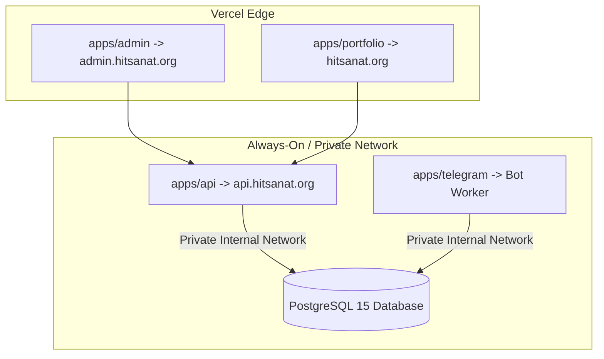

# Deployment Strategy & Platform Overview

## Hitsanat Kifl Children's Ministry Management System
**Document Version:** 2.2  
**Target Infrastructure:** Vercel (Frontend) & Railway (Backend & Database)  

---

## 1. Multi-Platform Deployment Map

---

## 2. Infrastructure Summary

| Component | Provider | Tier / Specs | Cost |
| :--- | :--- | :--- | :--- |
| `apps/admin` | **Vercel** | Hobby Tier (Edge CDN, SSL, Preview Builds) | $0.00/mo |
| `apps/portfolio` | **Vercel** | Hobby Tier (Static Generation + SSR) | $0.00/mo |
| `apps/api` | **Railway** | Always-On Express Web Service (Node.js 24) | $\approx \$0.80 – \$1.20$/mo |
| `apps/telegram` | **Railway** | Background Worker (Node.js 24) | $\approx \$0.35 – \$0.50$/mo |
| Database | **Railway** | Managed PostgreSQL 15 (Private Networking) | $\approx \$1.20 – \$1.50$/mo |
| Local Development | **Docker** | Containerized PostgreSQL 15 | Local |
| **Total Cloud Cost** | | **Covered by $5 monthly trial credit / base tier** | **$\approx \$2.50 – \$3.00$/mo** |
