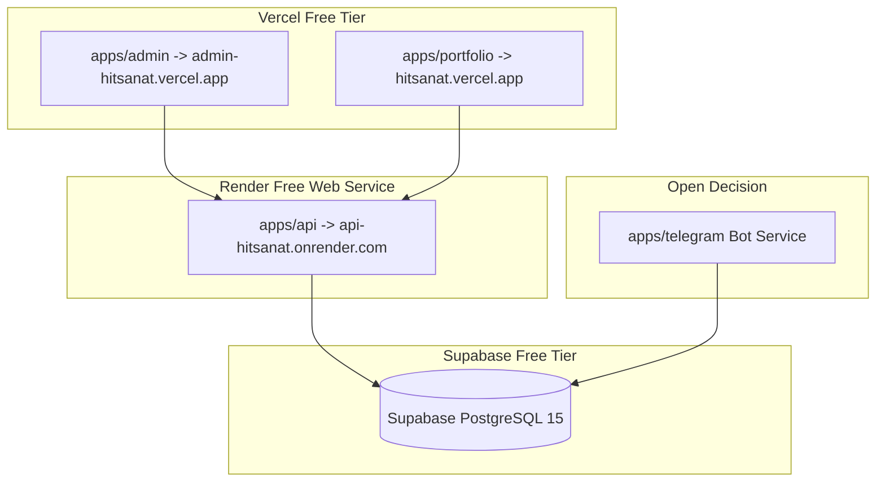

# Deployment Strategy & Platform Overview

## Hitsanat Kifl Children's Ministry Management System
**Document Version:** 2.1  
**Target Tier:** Free-Tier Cloud Ecosystem  

---

## 1. Multi-Platform Deployment Map

---

## 2. Infrastructure Summary

| Component | Provider | Tier / Specs | Cost |
| :--- | :--- | :--- | :--- |
| `apps/admin` | **Vercel** | Hobby Free Tier (Edge CDN, SSL, Preview Builds) | $0.00/mo |
| `apps/portfolio` | **Vercel** | Hobby Free Tier (Static Generation + SSR) | $0.00/mo |
| `apps/api` | **Render** | Free Web Service (512 MB RAM, 0.1 CPU, Node.js 24) | $0.00/mo |
| Database | **Supabase** | Free Project (500 MB Postgres Storage, PgBouncer) | $0.00/mo |
| `apps/telegram` | **Open Decision** | Standalone Worker (See [Open Decisions](../open-decisions.md)) | TBD |
| Local Development | **Docker** | Local containerized PostgreSQL 15 | Local |
