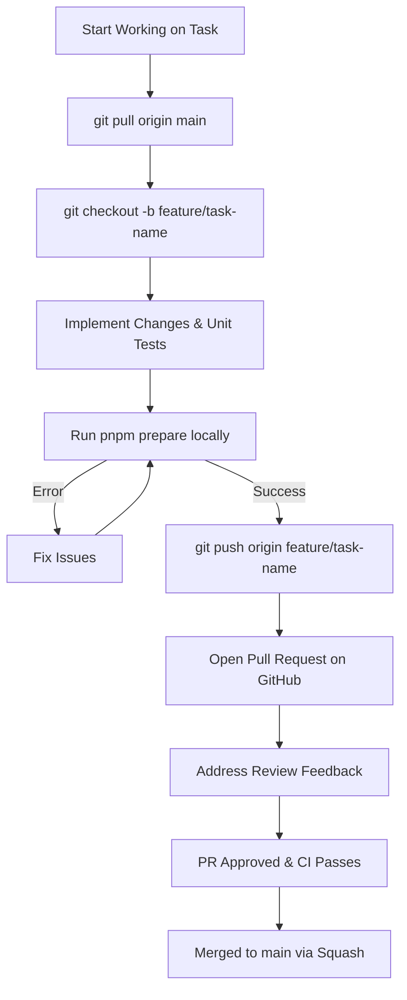

# Contributor Onboarding & Daily Development Guide

## Hitsanat Kifl Children's Ministry Management System
**Document Version:** 2.1  

---

## 1. Daily Development Workflow

---

## 2. Lane-Specific Onboarding Notes

### For Backend Support (Israel):
1. Pick tasks marked `OWNER: BACKEND SUPPORT (Israel)` in [Task Assignments](../roadmap/task-assignments.md).
2. Work strictly inside `apps/api/src/modules/<assigned-module>/` and `packages/validation`.
3. If database schema changes or auth alterations are required, consult the Core Lead before modifying `packages/database` or `packages/auth`.
4. Always request review from `@abrham-core-lead`.

### For Frontend Contributors:
1. Work inside `apps/admin`, `apps/portfolio`, and `packages/ui`.
2. Ensure components adapt to mobile screens ($360\text{ px}$) using shadcn/ui primitives.
3. Validate forms with React Hook Form using schemas from `@hitsanat/validation`.
4. Query endpoints using TanStack Query hooks; coordinate contract updates with the Core Lead.
