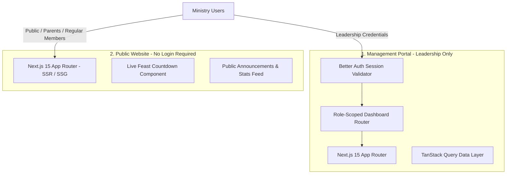

# Frontend Architecture Specification

## Hitsanat Kifl Children's Ministry Management System
**Document Version:** 2.1  
**Framework:** Next.js 15 (App Router, React 19, TypeScript)  
**State & Data Fetching:** TanStack Query v5  
**Component Library:** shadcn/ui (Preset `b1D0f7S7` via `packages/ui`) (ADR-0009)  

---

## 1. Applications & Separation of Concerns

The monorepo contains two distinct frontend web applications:



---

## 2. Admin Portal Architecture (`apps/admin`)

- **App Router Directory Structure:**
  ```text
  apps/admin/app/
  ├── (auth)/
  │   ├── login/
  │   └── layout.tsx
  ├── (dashboard)/
  │   ├── layout.tsx             # Sidebar, Header, Scoped Context Provider
  │   ├── page.tsx               # Redirects to role-specific default dashboard
  │   ├── chairperson/           # Executive overview & approvals
  │   ├── secretary/             # Registration & member/family rosters
  │   ├── timihrt/               # Education, teacher roster, exam scores
  │   ├── mezmur/                # Song playlist, Astegni assignments, Awdemerit
  │   ├── kutitr/                # Attendance verification, 5 collection routes
  │   ├── ekd/                   # Master plan, distribution, reports, announcements
  │   ├── kinetibeb/             # Films, puppets, Yeteret Abat
  │   ├── members/               # Global member directory
  │   ├── children/              # Global child & parent directory
  │   └── settings/              # User preferences & password reset
  └── layout.tsx
  ```

---

## 3. Data Fetching & Caching Strategy (TanStack Query)

All backend communication is orchestrated via typed TanStack Query hooks:
- **Query Keys Hierarchy:** Structured query keys (e.g. `['members', { subDept, search }]`, `['annual-plans', academicYear]`).
- **Optimistic Updates:** Applied during attendance marking and status toggles for instantaneous mobile UX.
- **Error Boundaries & Toasts:** User-friendly error feedback using Sonner toast alerts.
