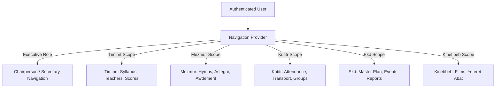

# Frontend Navigation & Role-Based Routing

## Hitsanat Kifl Children's Ministry Management System
**Document Version:** 2.1  

---

## 1. Dynamic Navigation Menu Architecture

The management portal sidebar dynamically filters available navigation routes based on the authenticated user's **Global Roles** and **Sub-Department Scopes**:



---

## 2. Navigation Item Registry

```typescript
export interface NavItem {
  title: string;
  titleAm: string;
  href: string;
  icon: string;
  requiredGlobalRoles?: string[];
  requiredSubDeptScope?: string;
}

export const navigationConfig: NavItem[] = [
  {
    title: 'Executive Overview',
    titleAm: 'አጠቃላይ አመራር',
    href: '/chairperson',
    icon: 'LayoutDashboard',
    requiredGlobalRoles: ['SUPER_ADMIN', 'CHAIRPERSON', 'SUB_CHAIRPERSON'],
  },
  {
    title: 'Registration & Records',
    titleAm: 'ምዝገባ እና መዛግብት',
    href: '/secretary',
    icon: 'UserPlus',
    requiredGlobalRoles: ['SUPER_ADMIN', 'SECRETARY'],
  },
  {
    title: 'Education (Timihrt)',
    titleAm: 'ትምህርት ክፍል',
    href: '/timihrt',
    icon: 'GraduationCap',
    requiredSubDeptScope: 'TIMIHRT',
  },
  {
    title: 'Hymns (Mezmur)',
    titleAm: 'መዝሙር ክፍል',
    href: '/mezmur',
    icon: 'Music',
    requiredSubDeptScope: 'MEZMUR',
  },
  {
    title: 'Attendance (Kutitr)',
    titleAm: 'ቁጥር ክፍል',
    href: '/kutitr',
    icon: 'CheckSquare',
    requiredSubDeptScope: 'KUTITR',
  },
  {
    title: 'Planning & Events (Ekd)',
    titleAm: 'ዕቅድ እና ዝግጅት',
    href: '/ekd',
    icon: 'CalendarDays',
    requiredSubDeptScope: 'EKD',
  },
  {
    title: 'Visual Arts (Kinetibeb)',
    titleAm: 'ኪነ-ጥበብ ክፍል',
    href: '/kinetibeb',
    icon: 'Film',
    requiredSubDeptScope: 'KINETIBEB',
  },
];
```
