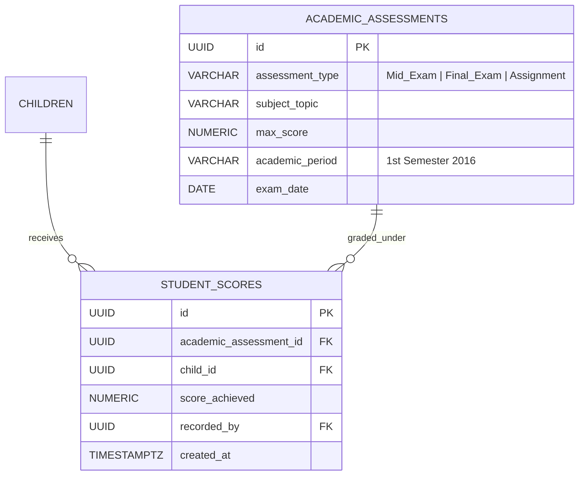

# Module Specification: Academic Tracking (M-07)

## Hitsanat Kifl Children's Ministry Management System
**Module ID:** M-07  
**Target Lane:** Backend Support (Israel) + Frontend Lane  
**Sub-Department Owner:** Timihrt Kifl (ትምህርት)  

---

## 1. Module Overview

The Academic Tracking module enables Timihrt leadership to record, analyze, and report children's spiritual education assessments.

### Key Capabilities:
- **Assessment Registry:** Supports Mid Exams, Final Exams, and Assignments across academic terms.
- **Grading & Scoring:** Records numeric scores, max scores, and subject topics for `Kutr 1` and `Kutr 2`.
- **Performance Summaries:** Aggregates individual child grade cards and cohort-level pass rates.

---

## 2. Relational Data Model

---

## 3. Key Use Cases

1. **`CreateAssessmentUseCase`:** Timihrt leader creates an exam profile (e.g., "Orthodox Dogma Mid-Exam - Kutr 2", Max: 40).
2. **`RecordStudentScoreUseCase`:** Enters student score. Validates that score is between 0 and `max_score`.
3. **`GetChildAcademicReportCardUseCase`:** Generates comprehensive academic performance summary for a child.
4. **`GetCohortPerformanceAnalyticsUseCase`:** Generates average score, standard deviation, and pass rate for Timihrt and Ekd reports.
