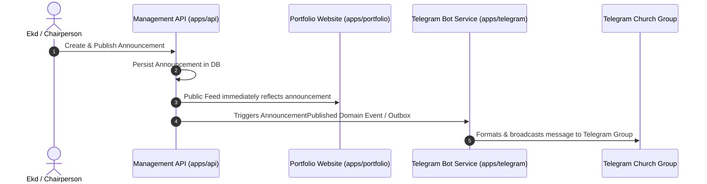

# Module Specification: Announcements & Integrations (M-11)

## Hitsanat Kifl Children's Ministry Management System
**Module ID:** M-11  
**Target Lane:** Backend Support (Israel) + Frontend Lane  
**Architectural ADR:** ADR-0006 (Decoupled Telegram Service)  

---

## 1. Module Overview

The Announcements module manages public notices, training updates, and feast reminders across the public website and Telegram.

---

## 2. Decoupled Architecture (ADR-0006)

- Announcements are published synchronously to the database.
- The Telegram Bot (`apps/telegram`) operates as an independent worker listening to announcement events or polling the outbox table, ensuring that Telegram API network delays or rate limits never block the admin portal.

---

## 3. Key Use Cases

1. **`CreateAnnouncementUseCase`:** Authors announcement with title, Amharic content, target audience (`Public`, `Members`, `Parents`), and publishing options.
2. **`PublishAnnouncementUseCase`:** Sets `is_published = true`, updates public API feed, and emits `AnnouncementPublishedEvent`.
3. **`GetPublicAnnouncementsUseCase`:** Returns sanitized list of published announcements for the portfolio website.
