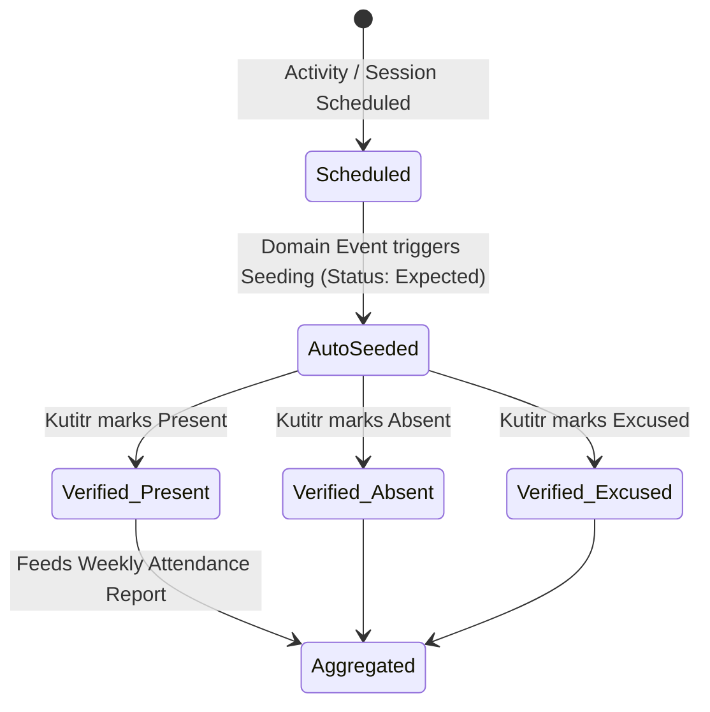

# Module Specification: Attendance & Transportation (M-06)

## Hitsanat Kifl Children's Ministry Management System
**Module ID:** M-06  
**Target Lane:** Core Backend (Lead) + Backend Support (Israel) + Frontend Lane  
**Architectural ADRs:** ADR-0001, ADR-0002, ADR-0003  

---

## 1. Module Overview & Operational Mechanics

Attendance tracking is managed primarily by **Kutitr Kifl** and covers both children and university student servants.

---

## 2. Key Architectural Decisions in Practice

1. **Auto-Seeding Attendance (ADR-0002):**
   - When a session (Saturday, Sunday, or Special Training) is created, the system auto-generates attendance rows with status `Expected` for all assigned members and cohort children.
   - Kutitr officials do not create records from scratch; they simply verify or correct the auto-seeded roster.
2. **Dedicated Relational Tables (ADR-0001):**
   - `program_session_attendance` for regular weekly weekend sessions.
   - `event_attendance` for special feast celebrations and extra rehearsals.
3. **Kutitr Transport Ownership (ADR-0003):**
   - Kutitr assigns $\ge 2$ student members to each of the 5 collection routes (*Apartama*, *Gende Boy*, *Gende Je*, *Cobalt*, *Bate*) each Friday.

---

## 3. Key Use Cases

1. **`SeedSessionAttendanceUseCase`:** Triggered on session creation; populates `Expected` attendee roster.
2. **`ConfirmAttendanceUseCase`:** Updates status to `Present`, `Absent`, or `Excused` with `confirmed_by` audit reference.
3. **`BatchConfirmRouteAttendanceUseCase`:** Allows a transport chaperone to mark all collected children on a route as present with a single click.
4. **`GetAttendanceSummaryReportUseCase`:** Generates weekly attendance percentage by cohort group and collection point.
