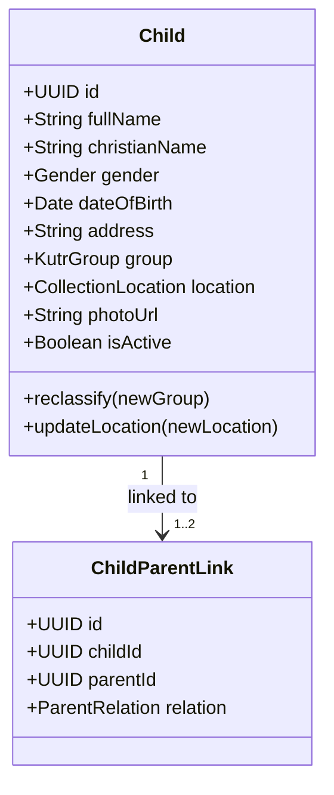

# Module Specification: Children Management (M-04)

## Hitsanat Kifl Children's Ministry Management System
**Module ID:** M-04  
**Target Lane:** Backend Support (Israel) + Frontend Lane  
**Architectural Lead:** Core Lead (Review & Constraints)  

---

## 1. Module Overview

The Children Management module manages local community child beneficiaries served by Hitsanat Kifl.

### Core Capabilities:
- **Child Enrollment & Profile Management:** Captures Christian and civilian names, birth date, gender, photo, and home neighborhood.
- **Group Classification (`Kutr 1` & `Kutr 2`):** Educational and pastoral cohorting managed by Kutitr.
- **5 Collection Point Assignments:** Maps each child to one of five gathering spots (*Apartama*, *Gende Boy*, *Gende Je*, *Cobalt*, *Bate*).
- **Monthly Birthday Query Engine:** Identifies children whose birthdays fall within the current Ethiopian calendar month for the monthly 15th celebration.

---

## 2. Domain Model & Classifications

---

## 3. Key Use Cases & Endpoints

1. **`RegisterChildUseCase`:** Registers child with mandatory cohort (`Kutr 1` / `Kutr 2`) and collection location.
2. **`ReclassifyChildGroupUseCase`:** Kutitr reclassifies child between `Kutr 1` and `Kutr 2`.
3. **`GetMonthlyBirthdaysUseCase`:** Translates current Gregorian date to Ethiopian calendar month and queries all children with birthdays occurring within that Ethiopian month.
4. **`GetChildrenByRouteUseCase`:** Returns the Saturday morning roster of children for a specific collection point.
