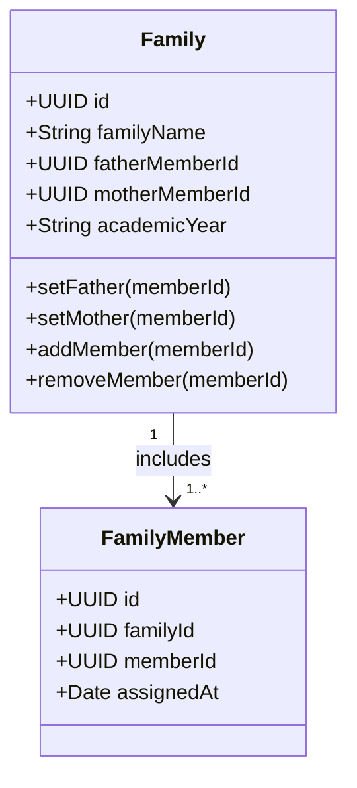

# Module Specification: Family System (M-02)

## Hitsanat Kifl Children's Ministry Management System
**Module ID:** M-02  
**Target Lane:** Backend Support (Israel) + Frontend Lane  
**Architectural Invariant:** One Father and One Mother per Family (BR-004, BR-005)  

---

## 1. Module Overview

The Family System (ቤተሰብ / Khnet) organizes student members into pastoral family units for spiritual fellowship and mutual care.

### Core Business Rules:
- **Leadership Structure (BR-004):** Each family unit requires exactly one Senior Male Member as **Father** (አባት) and one Senior Female Member as **Mother** (እናት).
- **Dual Role Capability (BR-005):** A student member can serve as the Father or Mother of Family A while simultaneously being registered as a general member in Family B.
- **Incremental Assignment:** New students are assigned to families upon enrollment without purging historical allocations.

---

## 2. Domain Model & Structure

---

## 3. Key Use Cases

1. **`CreateFamilyUseCase`:** Secretary creates family unit with name/number and academic year.
2. **`AssignFamilyParentsUseCase`:** Assigns senior male student as Father and senior female student as Mother.
3. **`AllocateMembersToFamilyUseCase`:** Adds student members to the family pastoral group.
4. **`GetFamilyRosterUseCase`:** Retrieves family details, assigned parents, and full member roster.
