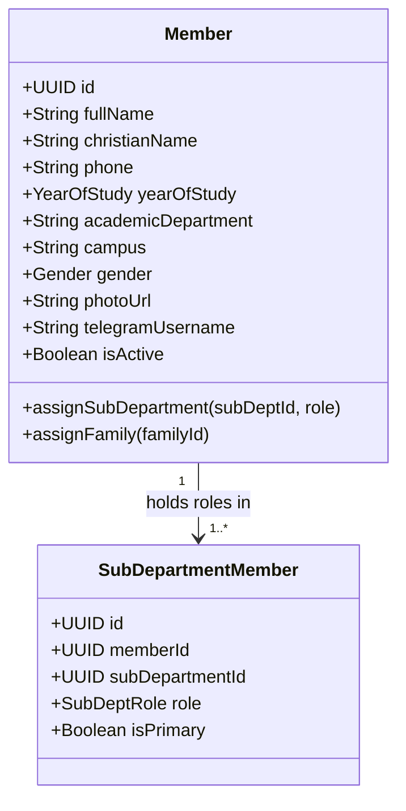

# Module Specification: Member Management (M-01)

## Hitsanat Kifl Children's Ministry Management System
**Module ID:** M-01  
**Target Lane:** Core Backend + Frontend Lane  

---

## 1. Module Overview

The Member Management module handles the complete lifecycle of university student servants (1st Year to GC) in Hitsanat Kifl.

### Core Capabilities:
- **Two-Stage Registration (BR-001):** Fast draft creation followed by family and sub-department allocation.
- **Multi-Department Assignments (BR-002):** Support for student membership in 1 to 5 sub-departments simultaneously.
- **Multi-Year Assignment Persistence (BR-003):** Roster continuity across academic semesters without data loss.
- **Fresh Student Onboarding:** Dedicated workflow for welcome events and batch enrollment.

---

## 2. Domain Model & Entities

---

## 3. Key Use Cases

1. **`CreateMemberStage1UseCase`:** Executed by Secretary. Validates mandatory basic fields and creates member record in `Draft/Pending Assignment` status.
2. **`EnrichMemberStage2UseCase`:** Links member to Family unit, assigns $\ge 1$ sub-department, attaches profile photo and Telegram username.
3. **`AssignMemberRolesUseCase`:** Assigns executive (`CHAIRPERSON`, `SUB_CHAIRPERSON`, `SECRETARY`) or sub-department roles (`Leader`, `Sub-Leader`, `Secretary`).
4. **`ArchiveGraduatedMemberUseCase`:** Flags graduating class (GC) members as alumni (`is_active = false`) while preserving historical attendance and teaching records.
