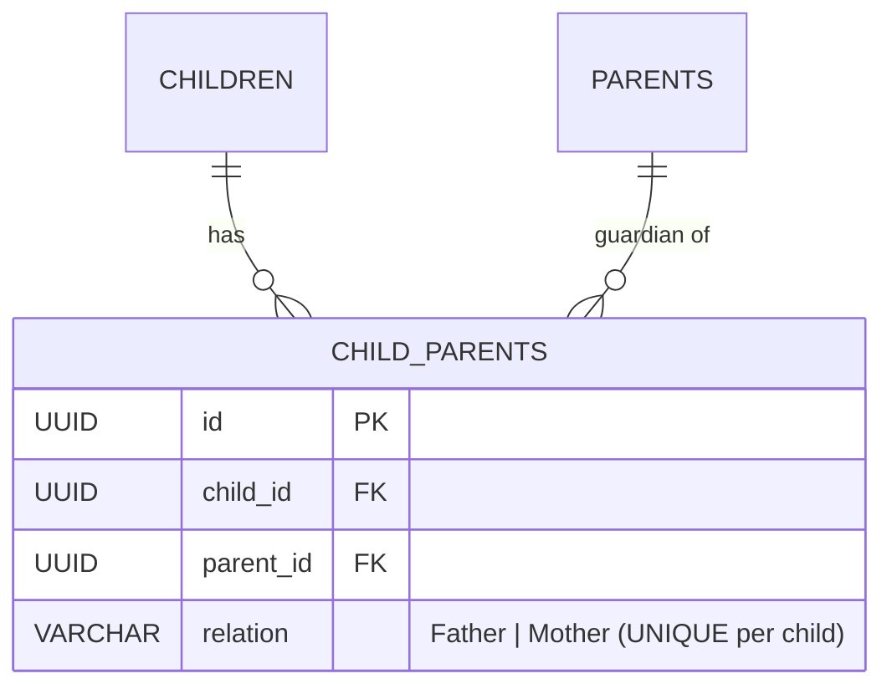

# Module Specification: Parent Management (M-05)

## Hitsanat Kifl Children's Ministry Management System
**Module ID:** M-05  
**Target Lane:** Backend Support (Israel) + Frontend Lane  
**Architectural Invariant:** Strict Parent Cardinality (BR-010, BR-011)  

---

## 1. Module Overview

The Parent Management module maintains guardian contact records and links them directly to registered children.

### Invariant Business Rules:
- **Strict Cardinality Constraint (BR-010):** A child may be linked to at most **one Father** (`Relation: Father`) and at most **one Mother** (`Relation: Mother`). Duplicate relations for a child are strictly prohibited.
- **Detailed Contact Info Required (BR-011):** Full name, primary phone, secondary phone, home address, occupation, and pastoral notes.
- **Shared Guardian Entity:** Sibling children can link to the same shared Parent record without data duplication.

---

## 2. Relational Schema & Cardinality Invariant

---

## 3. Key Use Cases

1. **`CreateParentUseCase`:** Creates parent contact record with full residential address and mobile phone numbers.
2. **`LinkChildParentUseCase`:** Establishes relationship between child and parent. Validates that the child does not already have an active link for the requested `relation` (`Father` or `Mother`). Returns `409 Conflict` on violation.
3. **`GetChildParentsUseCase`:** Retrieves the linked Father and Mother records for a specific child profile.
