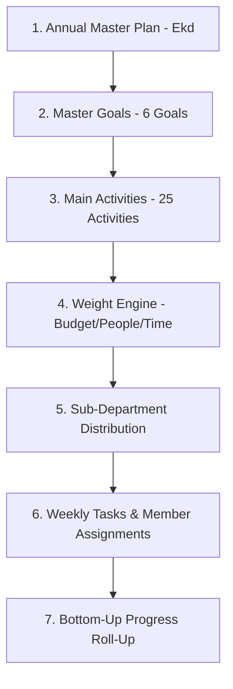

# Module Specification: Hierarchical Planning Engine (M-08)

## Hitsanat Kifl Children's Ministry Management System
**Module ID:** M-08  
**Target Lane:** Core Backend (Lead) + Frontend Lane  
**Sub-Department Owner:** Ekd Kifl (እቅድ)  

---

## 1. Module Overview & Strategic Purpose

The Planning Module is the core strategic engine of Hitsanat Kifl. It directly digitizes and executes the **Annual Action Plan** derived from `Action PLN.xlsx`.

---

## 2. Planning Structure & Action PLN Normalization

The spreadsheet structure is normalized into distinct domain entities:
1. **Master Plan Header:** Academic year, total budget ($\sum = 3500\text{ ETB}$), total people ($\sum = 112$), total time ($\sum = 45$).
2. **Goals:** 6 Master Goals spanning Spiritual Education, Arts, Hymns, Property Care, Attendance/Discipline, and Leadership Training.
3. **Activities:** 25 Activities with annual target numbers, execution periods, quarterly allocations (Q1–Q4), and calculated mathematical weights.
4. **Distribution:** Assignment to responsible sub-departments.
5. **Execution:** Weekly scheduling and progress logging.

---

## 3. Key Use Cases

1. **`CreateMasterPlanUseCase`:** Initializes master plan container.
2. **`AddGoalAndActivityUseCase`:** Adds goal and normalized activity, enforcing the weight calculation formula.
3. **`DistributePlanActivityUseCase`:** Allocates activity to a sub-department.
4. **`ScheduleWeeklyPlanTaskUseCase`:** Sub-department breaks distributed target into actionable weekly sessions.
5. **`RecordPlanProgressUseCase`:** Records actual numerical and qualitative output at the weekly level.
6. **`RollupPlanProgressUseCase`:** Aggregates weekly progress upward to monthly, quarterly, and annual completion percentages.
