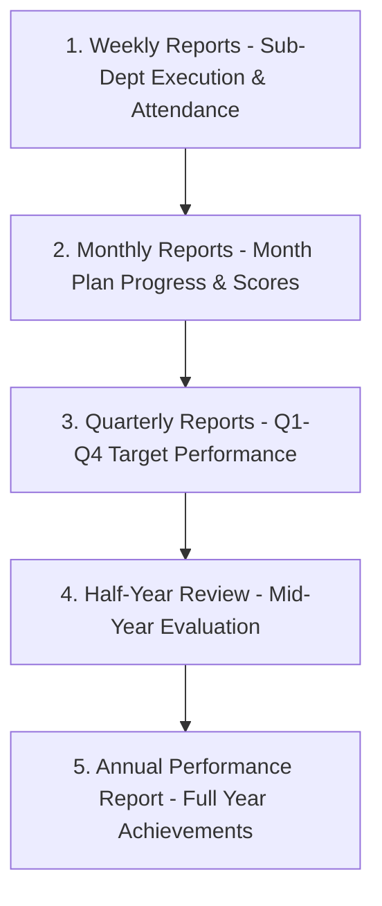

# Module Specification: Reports & Analytics (M-10)

## Hitsanat Kifl Children's Ministry Management System
**Module ID:** M-10  
**Target Lane:** Core Backend (Lead) + Backend Support (Israel) + Frontend Lane  

---

## 1. Module Overview & Report Hierarchy

The Reports module aggregates operational data, attendance, academic scores, and plan progress into standardized periodic reports.

---

## 2. Report Generation Types & Content

| Report Type | Cadence | Generator | Source Datasets | Output Metrics |
| :--- | :--- | :--- | :--- | :--- |
| **Weekly Report** | Weekly | Sub-Depts & Ekd | Weekly plans, session attendance | Completed tasks, attendance headcount, transport notes. |
| **Monthly Report**| Monthly | Ekd Kifl | Monthly targets, exam scores, Awdemerit | Monthly completion rate, average child scores, challenges. |
| **Quarterly Report**| Every 3 Mos | Ekd Kifl | Q1–Q4 target distributions | Weighted achievement index, budget utilization. |
| **Half-Year Report**| Twice a Year | Ekd & Chair | Semester reviews, pastoral records | Mid-year strategic review, member retention. |
| **Annual Report** | Annual | Ekd & Chair | Annual Master Plan, all sub-dept data | Comprehensive achievement summary, recommendations. |

---

## 3. Key Use Cases

1. **`SubmitSubDepartmentWeeklyReportUseCase`:** Sub-department leader submits weekly activity outcomes to Ekd.
2. **`GenerateConsolidatedReportUseCase`:** Ekd consolidates all sub-department submissions into an executive periodic report.
3. **`ApprovePeriodicReportUseCase`:** Chairperson signs off and archives approved report.
4. **`ExportReportToPdfUseCase`:** Generates print-ready formatted report document.
