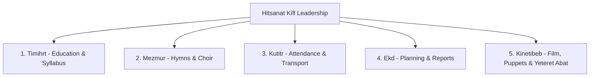

# Module Specification: Sub-Department Workflows (M-03)

## Hitsanat Kifl Children's Ministry Management System
**Module ID:** M-03  
**Target Lane:** Core Backend (Lead) + Backend Support (Israel) + Frontend Lane  

---

## 1. Sub-Department Charter & Scope

Hitsanat Kifl operates via five specialized sub-departments:

---

## 2. Department-Specific Responsibilities & Workflows

### 2.1 Timihrt (ትምህርት — Education)
- **Roadmap & Syllabus:** Prepares spiritual curriculum for `Kutr 1` (basic Bible stories, Orthodox traditions) and `Kutr 2` (Dogma, Church History, Ge'ez language).
- **Teacher Roster:** Assigns qualified teachers from its own member roster to weekend classes.
- **Academic Scores:** Enters and manages Mid Exams, Final Exams, and Assignments.

### 2.2 Mezmur (መዝሙር — Hymns & Choir)
- **Hymn Repertoire:** Curates song playlists, liturgical hymns, and feast chant selections.
- **Mezmur Astegni Assignment:** Assigns choir conductors from its members to lead Saturday rehearsals.
- **Awdemerit Coordination:** Prepares the monthly church presentation where children chant before the congregation.

### 2.3 Kutitr (ቁጥር — Attendance & Logistics)
- **Weekend Headcounts:** Records physical attendance for Saturday (8:00–11:30) and Sunday (8:00–10:00).
- **Transport Chaperones:** Assigns $\ge 2$ members to each of the 5 child collection points.
- **Cohort Group Management:** Manages and reclassifies children between `Kutr 1` and `Kutr 2`.

### 2.4 Ekd (እቅድ — Strategic Planning & Events)
- **Annual Master Plan:** Authors the authoritative master plan and calculates activity weights.
- **Plan Distribution:** Distributes plan activities to the 5 sub-departments.
- **Periodic Reporting:** Aggregates weekly, monthly, quarterly, and annual reports.

### 2.5 Kinetibeb (ቅንጥብጥብ — Visual Arts & Storytelling)
- **Religious Film Library:** Manages film screenings and visual spiritual media.
- **Yeteret Abat Programs:** Schedules moral storytelling sessions and assigns members.
- **Puppet & Drama:** Coordinates theatrical spiritual performances during special feasts.
