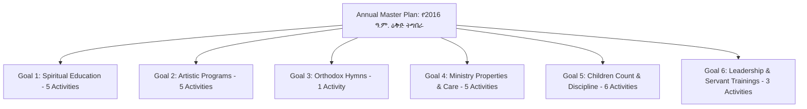

# Planning System: Annual Master Plan Specification

## Hitsanat Kifl Children's Ministry Management System
**Document Version:** 2.1  
**Source-of-Truth:** `Action PLN.xlsx` (2016 E.C. Baseline)  

---

## 1. Master Plan Structure & Normalization

The Annual Master Plan is the overarching strategic roadmap created by **Ekd Kifl** and approved by the **Chairperson**.

---

## 2. Mathematical Weight Formulation

Every activity's weight is mathematically computed using the Action Plan 3-Factor Formula:

$$\text{Weight}_i = \frac{1}{3} \left[ \left(\frac{\text{Budget}_i}{\sum \text{Budget}} \times 100\right) + \left(\frac{\text{People}_i}{\sum \text{People}} \times 100\right) + \left(\frac{\text{Time}_i}{\sum \text{Time}} \times 100\right) \right]$$

### System Baseline Totals (from `Action PLN.xlsx` Row 30):
- **Total Budget ($\sum \text{Budget}$):** `3,500.00 ETB`
- **Total Human Resource Units ($\sum \text{People}$):** `112 units`
- **Total Time / Duration Units ($\sum \text{Time}$):** `45 units`
- **Sum of All Activity Weights ($\sum \text{Weight}$):** `100.00%`

---

## 3. Normalized Master Catalog (6 Goals & 25 Activities)

| No. | Goal (ግብ) | Main Activity (ዋና ተግባር) | Expected Result (ውጤት) | Annual Target | Budget (ETB) | People | Time | Weight % | Responsible Sub-Dept |
| :---: | :--- | :--- | :--- | :---: | :---: | :---: | :---: | :---: | :---: |
| **1.1** | **1. ለሕጻናት መንፈሳዊ ት/ት ማስተማር** | ስለግዕዝ ቋንቋ ፊደላት እውቀት ማስጨበጥ እና የአብነት ት/ት ማስተማር | ግዕዝ ቋንቋ እና አብነት ትምህርት ማወቅ | 36 | 0.00 | 2 | 1 | **1.3360%** | Timihrt |
| **1.2** | | እሁድ ከቅዳሴ በኋላ ተዓምረ ማርያምን ስርዓተ ቤ/ክ በጠበቀ መልኩ ማቅረብ | ተዓምረ ማርያም ስርዓት ማስተማር | 18 | 0.00 | 1 | 1 | **1.0384%** | Timihrt |
| **1.3** | | በተማሩት መሰረት የጥያቄና መልስ ውድድር ማዘጋጀት | ሕጻናት የቤ/ክ ስርዓት አውቀውና ጠብቀው ማየት | 7 | 0.00 | 3 | 2 | **2.3743%** | Timihrt |
| **1.4** | | የሕጻናት አምድን ለሰሌዳ መፅሔት ማዘጋጀት | የሰሌዳ መጽሔት ማሳተም | 9 | 0.00 | 1 | 2 | **1.7791%** | Timihrt |
| **1.5** | | ከሰንበት ት/ት ቤቱ ጋር በመሆን አዲሱ ስርዐተ ት/ት ማስተግበር | አዲስ ሥርዓተ ትምህርት መተግበር | 32 | 0.00 | 10 | 4 | **5.9392%** | Timihrt |
| **2.1** | **2. ኪነ-ጥበባዊ ዝግጅቶችን ማቅረብ** | አሻንጉሊቶችን በመጠቀም ማስተማር | በይዘት የተዘጋጁ አሻንጉሊቶች | 6 | 2,500.00 | 2 | 2 | **25.8862%** | Kinetibeb |
| **2.2** | | በታሪክ እናትና አባት ታሪኮችን ማቅረብ (የተረት አባት) | የታሪክ ፕሮግራሞች ማቅረብ | 8 | 0.00 | 2 | 1 | **1.3360%** | Kinetibeb |
| **2.3** | | መንፈሳዊ ፊልሞችን ማሳየት | መንፈሳዊ ፊልም ማሳየት | 8 | 0.00 | 1 | 1 | **1.0384%** | Kinetibeb |
| **2.4** | | ወቅቱንና ስርዓቱን የጠበቀ መዝሙር ማስጠናት | መንፈሳዊ ይዘትና ስርዓቱን የጠበቀ መዝሙር ሲቀርብ ማየት | 72 | 0.00 | 8 | 2 | **3.8624%** | Mezmur |
| **2.5** | | በየ15 ቀኑ እሑድ ጠዋት በዓውደ ምህረት ሕጻናቱ መዝሙር እንዲያቀርቡ ማድረግ | ዓውደ ምህረት መዝሙር ማቅረብ | 18 | 0.00 | 8 | 1 | **3.1217%** | Mezmur |
| **3.1** | **3. ኦርቶዶክሳዊ መዝሙራትን ሕጻናት እንዲያጠኑ ማድረግ** | ለጥምቀት እና ለልደት በዓል መዝሙሮችን አጥንተው እንዲያቀርቡ ማድረግ | የበዓላት መዝሙር ዝግጅት ማጠናቀቅ | 2 | 0.00 | 10 | 3 | **5.1984%** | Mezmur |
| **4.1** | **4. በክፍሉ የሚገኙ ንብረቶች መጠበቅና ቁጥራቸውን ማሳደግ** | አልባስ፣ ቆብና የመሳሰሉትን ንብረቶች መንከባከብ | ንብረቶችን በአግባቡ መያዝ | 1 | 500.00 | 3 | 2 | **7.1362%** | Kutitr / Ekd |
| **4.2** | | መንፈሳዊ አስተማሪ መፅሐፍትን ማሰባሰብ | መጻሕፍት ማሰባሰብ | 50 | 0.00 | 1 | 3 | **2.5198%** | Timihrt |
| **4.3** | | ተጨማሪ አልባሳት የሚገኝበትን መንገድ መፍጠር | አልባሳት ማሰባሰብ | 1 | 0.00 | 0 | 0 | **0.0000%** | Ekd |
| **4.4** | | የህፃናቱን የስነ-ምግባር መቆጣጠሪያ ደብተር በማሻሻል በድጋሚ አገልግሎት ላይ እንዲውል ማድረግ | የስነ-ምግባር ደብተር ማሻሻል | 18 | 0.00 | 3 | 1 | **1.6336%** | Kutitr |
| **4.5** | | የህፃናቱን ቁጥር ለማሳደግ መጣር | የሕፃናት ምዝገባ ቁጥር ማሳደግ | 10 | 0.00 | 2 | 2 | **2.0767%** | Kutitr |
| **5.1** | **5. የህፃናትን ቁጥር ማሳደግና ስነ-ምግባራቸውን ማሻሻልና መቆጣጠር** | ህፃናቱ ፀባያቸው አዎንታዊ ዘላቂ ለውጥ እንዲያመጣ መንገዶችን ቀርፆ ማሳየት | አዎንታዊ የስነ-ምግባር ለውጥ | 9 | 0.00 | 11 | 2 | **4.7553%** | Kutitr |
| **5.2** | | ሕፃናቱን ከወጣት አባላት ጋር ማቀራረብ | ማህበራዊ ትስስር ማጠናከር | 9 | 0.00 | 1 | 1 | **1.0384%** | Kutitr |
| **5.3** | | በሕፃኑ በቅዱስ ቂርቆስና በእናቱ በቅድስት እየሉጣ የዝክር በዓል ላይ የፀሎት መርሐግብር ማድረግ | የቂርቆስ ዝክር ጸሎት ማካሄድ | 9 | 500.00 | 5 | 1 | **6.9907%** | Ekd / All |
| **5.4** | | በየሳምንቱ ቅዳሜ ሕፃናቱን ከቤታቸው አባላትን መድቦ መሰብሰብ | 5ቱ የመሰብሰቢያ ቦታዎች ማጓጓዝ | 36 | 0.00 | 12 | 2 | **5.0529%** | Kutitr |
| **5.5** | | ህፃናቱ ስለሚሰበሰቡበት ቤት መረጃ መሰብሰብ | የመኖሪያ ቤት መረጃ ማጠናቀር | 2 | 0.00 | 11 | 3 | **5.4960%** | Kutitr |
| **5.6** | | በየመርሐግብራቱ አቴንዳንስ መቆጣጠር | የቅዳሜ/እሁድ አቴንዳንስ መመዝገብ | 72 | 0.00 | 2 | 1 | **1.3360%** | Kutitr |
| **6.1** | **6. የተለያዩ ስልጠናዎችን መስጠት** | ከሕፃናቱ መካከል የመርሐግብር አመራር ስልጠና መስጠት | የሕፃናት አመራር ስልጠና መስጠት | 2 | 0.00 | 2 | 3 | **2.8175%** | Timihrt |
| **6.2** | | ሕፃናቱን የመዝሙር ሽብሻቦ እንቅስቃሴ ማስጠናት | የሽብሻቦ እንቅስቃሴ ማስጠናት | 9 | 0.00 | 8 | 2 | **3.8624%** | Mezmur |
| **6.3** | | በመንፈሳዊ በዓላት ላይ ሕፃናቱ መንፈሳዊ ትርዒት እንዲያቀርቡ ማድረግ | የበዓላት መንፈሳዊ ትርዒት ማቅረብ | 2 | 0.00 | 3 | 2 | **2.3743%** | Kinetibeb |
| **TOTAL**| | **25 Master Activities** | | | **3,500.00** | **112** | **45** | **100.0000%** | |
