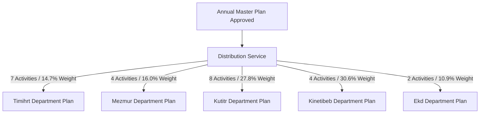

# Planning System: Plan Distribution to Sub-Departments

## Hitsanat Kifl Children's Ministry Management System
**Document Version:** 2.1  
**Planning Hierarchy Level:** Master Plan Distribution (ADR-0005, BR-031)  

---

## 1. Distribution Philosophy

Once the Annual Master Plan is approved by the Chairperson, **Ekd Kifl** executes the distribution workflow.

---

## 2. Sub-Department Allocation Matrix

| Sub-Department | Assigned Activity Numbers | Total Allocated Activities | Combined Weight Contribution | Primary Focus Area |
| :--- | :--- | :---: | :---: | :--- |
| **Timihrt (ትምህርት)** | 1.1, 1.2, 1.3, 1.4, 1.5, 4.2, 6.1 | **7** | **14.73%** | Spiritual syllabus, Ge'ez, exams, teacher deployment. |
| **Mezmur (መዝሙር)** | 2.4, 2.5, 3.1, 6.2 | **4** | **16.04%** | Hymns, Awdemerit performances, choir conductors. |
| **Kutitr (ቁጥር)** | 4.1 (Shared), 4.4, 4.5, 5.1, 5.2, 5.4, 5.5, 5.6 | **8** | **27.76%** | Attendance, 5 transport routes, child discipline. |
| **Kinetibeb (ቅንጥብጥብ)**| 2.1, 2.2, 2.3, 6.3 | **4** | **30.63%** | Puppet theater, films, Yeteret Abat, feast drama. |
| **Ekd (እቅድ)** | 4.3, 5.3 (Shared) | **2** | **10.84%** | Master monitoring, events, reports, saint commemorations. |

---

## 3. Sub-Department Execution Invariant (BR-031)
- Sub-department leaders log into `apps/admin` and access the **"My Department Plan"** view.
- Sub-departments cannot modify the core targets, expected results, or allocated weights assigned to them by Ekd.
- Sub-departments break their distributed targets into **Weekly Tasks** and assign active student members to execute them.
