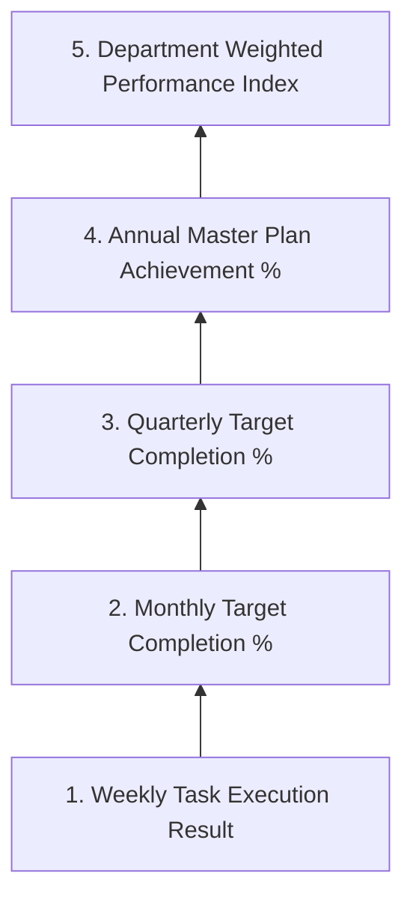

# Planning System: Bottom-Up Progress Tracking

## Hitsanat Kifl Children's Ministry Management System
**Document Version:** 2.1  
**Core Logic:** Hierarchical Progress Roll-Up Engine (BR-032)  

---

## 1. Bottom-Up Aggregation Pipeline

Progress recorded at the granular weekly task level aggregates dynamically up the planning hierarchy:

---

## 2. Progress Roll-Up Mathematical Formulations

### 2.1 Activity Completion Percentage
For any activity $i$:
$$\text{Completion Rate}_i = \min\left(100.0, \frac{\text{Actual Output}_i}{\text{Planned Target}_i} \times 100\right)$$

### 2.2 Weighted Department Performance Index (KPI)
For a sub-department with assigned activities $A$:
$$\text{Department Score} = \sum_{i \in A} \left( \text{Completion Rate}_i \times \text{Weight}_i \right)$$

### 2.3 System-Wide Master Achievement Index
$$\text{Master Ministry Score} = \sum_{i=1}^{25} \left( \text{Completion Rate}_i \times \text{Weight}_i \right)$$
Since $\sum_{i=1}^{25} \text{Weight}_i = 100.0\%$, the Master Ministry Score evaluates overall annual performance on a normalized $0\text{ to }100\%$ scale.
