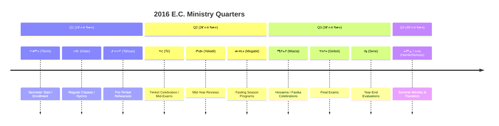
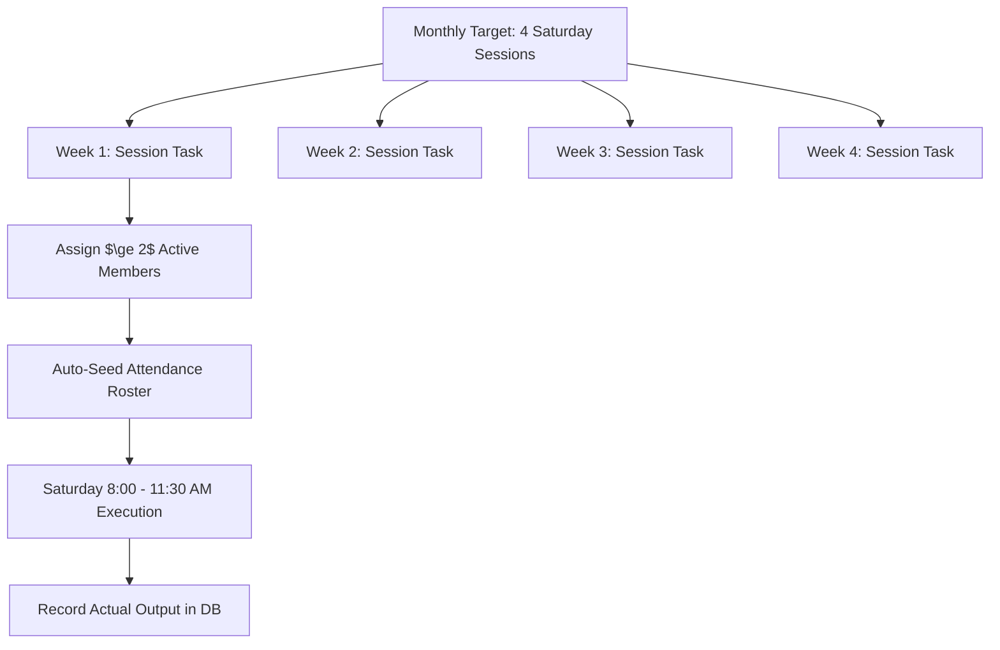

# Planning System: Quarterly, Monthly & Weekly Planning

## Hitsanat Kifl Children's Ministry Management System
**Document Version:** 2.1  
**Time Horizon:** Multi-Period Planning Hierarchy  

---

## 1. Quarterly Planning (Q1 – Q4 Distribution)

The academic year plan is partitioned across four operational quarters aligned with the Ethiopian academic calendar:

---

## 2. Monthly Target Scheduling

Each activity specifies planned targets across the 9 core operational months in `Action PLN.xlsx`:
1. **ጥቅምት (Tikimt):** Initial setup, registration drive, teacher allocation.
2. **ኅዳር (Hidar):** Regular curriculum rollout, Saturday transport route stabilization.
3. **ታኅሣሥ (Tahsas):** Timket choir preparation, Mid-exam syllabus completion.
4. **ጥር (Tir):** Epiphany (Timket) feast programs, Mid exams.
5. **የካቲት (Yekatit):** Mid-year performance evaluation, parent pastoral visits.
6. **መጋቢት (Megabit):** Lent spiritual songs, moral storytelling series.
7. **ሚያዝያ (Miazia):** Palm Sunday (Hosaena) presentations, Easter celebrations.
8. **ግንቦት (Ginbot):** Final academic exams, comprehensive attendance audits.
9. **ሰኔ (Sene):** Annual review, graduation class (GC) transition, annual report.

---

## 3. Weekly Execution & Multi-Member Assignment (BR-014)

### Invariants:
- Weekly tasks directly reference the parent `plan_distribution_id`.
- The system prevents single-member assignments for safety and accountability ($\ge 2$ members required).
