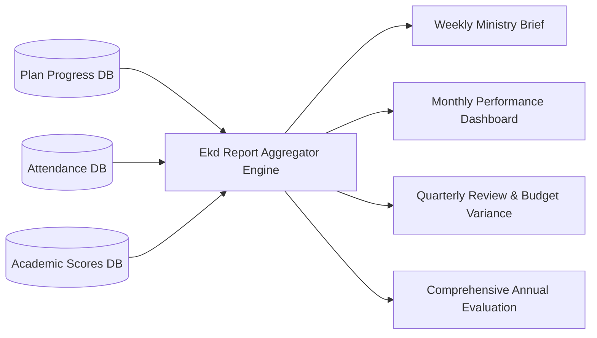

# Planning System: Reporting Against the Master Plan

## Hitsanat Kifl Children's Ministry Management System
**Document Version:** 2.1  
**Sub-Department Owner:** Ekd Kifl (እቅድ)  

---

## 1. Reporting Engine Architecture

The reporting engine translates aggregated plan progress, attendance records, and academic evaluations into formal ministry reports.

---

## 2. Standard Report Structure & Fields

Every formal periodic report includes:
1. **Executive Summary:** Overall completion rate and key milestones achieved.
2. **Sub-Department Performance Breakdown:**
   - Planned Target vs Actual Result.
   - Weighted Contribution Index.
   - Resource and budget utilization (Planned ETB vs Disbursed ETB).
3. **Attendance & Shepherd Summary:** Average Saturday/Sunday headcount, child attendance by collection point, student servant participation.
4. **Academic Performance Summary:** Average test scores for `Kutr 1` and `Kutr 2`.
5. **Challenges & Operational Bottlenecks (ችግሮች እና ተግዳሮቶች):** Recorded by sub-department leaders.
6. **Recommendations & Next Period Adjustments (መፍትሔዎች እና ቀጣይ አቅጣጫ):** Prepared by Ekd and Chairperson.
