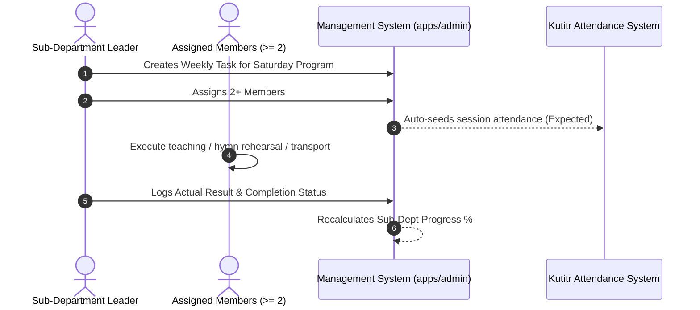

# Planning System: Weekly Planning & Member Execution

## Hitsanat Kifl Children's Ministry Management System
**Document Version:** 2.1  

---

## 1. Weekly Execution Workflow

Weekly planning coordinates the Saturday (8:00–11:30 AM) and Sunday (8:00–10:00 AM) weekend ministry sessions.

---

## 2. Weekly Task Status Lifecycle

- `PLANNED`: Task scheduled for the upcoming weekend.
- `IN_PROGRESS`: Program underway or actively in rehearsal.
- `COMPLETED`: Session successfully conducted; output logged.
- `DELAYED`: Postponed due to university exams or church feast rescheduling.
- `CANCELLED`: Explicitly cancelled with recorded justification.
