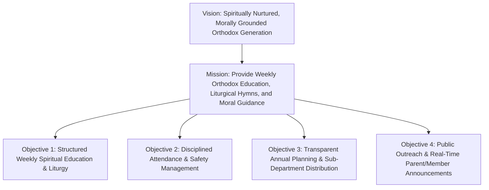

# Business Requirements Document (BRD)

## Hitsanat Kifl Children's Ministry Management System
**Haramaya University Gibi Gubae — Orthodox Tewahedo Student Association**  
**Document Version:** 2.1  
**Target Platform:** Web Application (Management Portal & Public Portfolio) + Telegram Service  

---

## 1. Introduction & Ministry Context

### 1.1 Organizational Background
**Hitsanat Kifl** (የህጻናት ክፍል — Children's Department) is an active operational sub-department of the **Haramaya University Gibi Gubae** (የሀረማያ ዩኒቨርስቲ ግቢ ጉባኤ), the Ethiopian Orthodox Tewahedo Church university students' association. 

The ministry operates under a unique campus ministry model:
1. **Members (አባላት):** All active members are undergraduate and postgraduate university students from 1st Year (Freshman) through Graduation Class (GC). Members volunteer their time, energy, and spiritual skills across academic semesters.
2. **Beneficiaries (ሕፃናት እና ወላጆች):** The ministry serves local community children residing in five surrounding zones/villages near the campus, along with their Orthodox Christian parents. Children and parents are not university members but are registered beneficiaries nurtured by the ministry.
3. **Leadership Cycle:** Student leadership undergoes regular academic transitions. Knowledge retention, clear operating procedures, and structured records are essential for seamless leadership handovers.

### 1.2 Mission, Vision, and Objectives



- **Vision:** To foster a spiritually grounded, morally upright, and culturally knowledgeable generation of children who understand Orthodox Christian traditions and teachings.
- **Mission:** To organize, execute, and monitor regular weekend spiritual education, hymn rehearsals, visual arts, and family-based pastoral care through organized student servant teams.
- **Key Ministry Objectives:**
  - Standardize children's spiritual curriculum across two developmental age groups (Kutr 1 and Kutr 2).
  - Safely gather, transport, and shepherd children from 5 designated community collection points every Saturday morning.
  - Distribute and track the 2016/2017+ E.C. Annual Action Master Plan across 5 specialized sub-departments with mathematical progress weighting.
  - Bridge communication between campus leadership, student servants, parents, and the broader church community.

---

## 2. Stakeholder Taxonomy & User Personas

| Stakeholder Persona | Role Code | Ministry Function | System Interaction Scope |
| :--- | :--- | :--- | :--- |
| **Chairperson** (ሰብሳቢ) | `LEADERSHIP_CHAIR` | Head of Hitsanat Kifl; ultimate spiritual and operational overseer | Full management portal access; approves registrations, plans, and reports. |
| **Sub-Chairperson** (ምክትል ሰብሳቢ) | `LEADERSHIP_SUB_CHAIR` | Deputy leader assisting Chairperson; operational coordination | Delegated executive portal access across all sub-departments. |
| **Secretary** (ጸሐፊ) | `LEADERSHIP_SECRETARY` | Official records manager and registrar | Full CRUD on Members, Children, Parents, Families, and Classifications. |
| **Timihrt Leader** (የትምህርት ኃላፊ) | `SUB_LEAD_TIMIHRT` | Leads curriculum planning, teacher assignments, and exam scores | Timihrt dashboard; manages educational roadmap, teacher roster, academic records. |
| **Mezmur Leader** (የመዝሙር ኃላፊ) | `SUB_LEAD_MEZMUR` | Leads hymn training, choir conductors (Astegni), Awdemerit | Mezmur dashboard; song repository, rehearsal schedules, Awdemerit preparation. |
| **Kutitr Leader** (የቁጥር ኃላፊ) | `SUB_LEAD_KUTITR` | Oversees attendance, safety, collection points, and family tracking | Kutitr dashboard; Saturday/Sunday attendance, 5 collection routes, activity attendance. |
| **Ekd Leader** (የዕቅድ ኃላፊ) | `SUB_LEAD_EKD` | Directs Annual Master Plan, event schedules, and periodic reports | Ekd dashboard; master plan creation, sub-dept distribution, progress roll-up, reports. |
| **Kinetibeb Leader** (የኪነ-ጥበብ ኃላፊ) | `SUB_LEAD_KINETIBEB` | Directs religious films, puppet theater, Yeteret Abat sessions | Kinetibeb dashboard; program scheduling, script/film assets, event segments. |
| **Regular Member** (አባል) | `MEMBER_REGULAR` | Student servants participating in teaching, choir, and transport | **No Admin Portal Access**; interacts via Public Portfolio Website & Telegram. |
| **Child / Student** (ሕፃን) | `CHILD_BENEFICIARY` | Enrolled child receiving education and pastoral care | Data entity only; tracked for attendance, tests, and birthdays. |
| **Parent / Guardian** (ወላጅ) | `PARENT_CONTACT` | Father/Mother of enrolled child | Data entity only; linked contact records for safety notifications. |
| **Super Admin** | `SYSTEM_SUPER_ADMIN` | Technical systems administrator & DevOps manager | Full system configuration, permission overrides, database audit logs. |

---

## 3. High-Level Business Drivers & Operational Context

```mermaid
journey
    title A Week in the Life of Hitsanat Kifl Operations
    section Preparation
      Ekd distributes weekly plan targets: 5: Ekd Leader
      Timihrt assigns teachers: 4: Timihrt Leader
      Mezmur selects hymn set: 4: Mezmur Leader
      Kutitr assigns route shepherds: 5: Kutitr Leader
    section Saturday Morning (8:00 - 11:30 AM)
      Gather children from 5 locations: 5: Members, Kutitr
      Prayer & Spiritual Education: 4: Timihrt
      Hymn rehearsal (Mezmur): 4: Mezmur
      Puppet / Yeteret Abat: 5: Kinetibeb
      Attendance recording: 5: Kutitr
      Safe return of children: 5: Kutitr, Members
    section Sunday Morning (8:00 - 10:00 AM)
      Parents bring children to church: 4: Parents
      Post-Liturgy spiritual reinforcement: 4: Timihrt, Mezmur
      Sunday attendance confirmation: 5: Kutitr
    section Weekly Review & Roll-Up
      Sub-departments record actual output: 4: Sub-dept Leaders
      Ekd rolls up weekly progress to master plan: 5: Ekd Leader
```

### 3.1 Weekly Operational Rhythm
1. **Saturday Ministry Program (8:00 AM – 11:30 AM):**
   - **Transportation & Gathering (8:00 – 8:45 AM):** Assigned members travel to the 5 designated child collection locations (Apartama, Gende Boy, Gende Je, Cobalt, Bate) to shepherd children safely to church grounds.
   - **Opening Prayer (8:45 – 9:00 AM):** Collective prayer led by assigned leadership.
   - **Timihrt Segment (9:00 – 9:45 AM):** Educational classes categorized by Kutr 1 & Kutr 2 curriculums.
   - **Mezmur Segment (9:45 – 10:30 AM):** Liturgical hymns and Orthodox songs led by assigned *Mezmur Astegni*.
   - **Kinetibeb Segment (10:30 – 11:00 AM):** Visual storytelling, puppet theater, or *Yeteret Abat* presentation.
   - **Attendance Confirmation (11:00 – 11:15 AM):** Kutitr officials verify physical headcount against auto-seeded roster.
   - **Closing Prayer & Safe Escort (11:15 – 11:30 AM):** Closing blessings, followed by chaperoned escort back to collection points.

2. **Sunday Ministry Program (8:00 AM – 10:00 AM):**
   - Parents accompany children directly to the church compound post-Divine Liturgy (ቅዳሴ).
   - Focused moral teaching (*Te'amire Maryam* reading and explanation), hymn practice, and attendance tracking.

3. **Monthly & Periodic Cycles:**
   - **Awdemerit (አውደምህረት):** Monthly appearance where children sing hymns before the entire church congregation.
   - **Monthly Birthday Celebrations:** Commemorating children born in the current Ethiopian calendar month on the 15th day.
   - **Fixed Feasts (ጥምቀት፣ ሆሳዕና):** Intensive pre-event training programs requiring extra sessions and multi-member team assignments.
   - **Semester Planning Reviews:** Quarterly and half-year performance evaluations against the Annual Action Plan.

---

## 4. Key Business Constraints & Invariants

1. **Strict Membership Separation:**
   - University student members are administrative and operational servants.
   - Children and parents are community beneficiaries. They are **never** represented as system user accounts.
2. **Zero-Access for Non-Leadership Members:**
   - Regular student members do not authenticate into the management portal. They receive public information via the Portfolio Web Application and announcements via the Telegram Channel/Group.
3. **Scoped Operational Autonomy:**
   - Each sub-department leader manages only their own domain (e.g., Timihrt cannot edit Mezmur playlists; Mezmur cannot alter transportation routes).
4. **Canonical Gregorian Storage with Ethiopian Boundary Presentation:**
   - All temporal data is persisted in PostgreSQL as UTC / Gregorian timestamps.
   - The user interface must present all dates, schedules, academic terms, and birthday queries according to the Ethiopian Calendar (using `ethiopian-calendar-new`).
5. **Traceable Hierarchical Planning:**
   - No standalone or disconnected activities may exist in isolation; every weekly activity must roll up through monthly and quarterly milestones to an approved Annual Master Plan goal.
