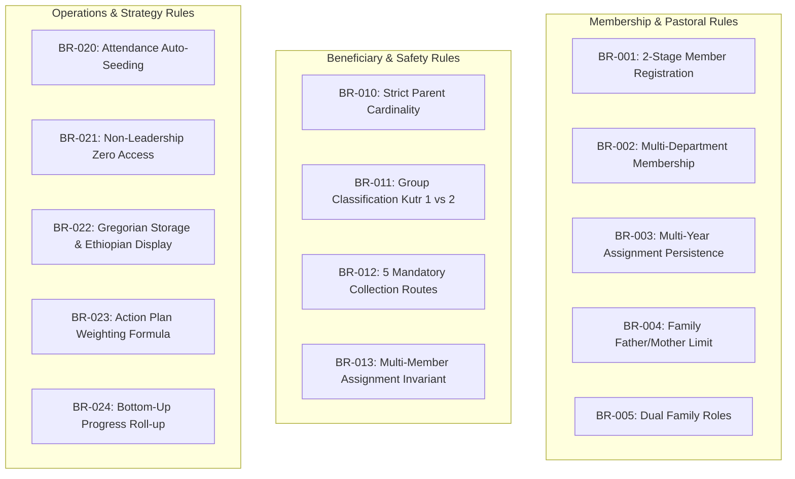

# Business Rules Specification (BR)

## Hitsanat Kifl Children's Ministry Management System
**Document Version:** 2.1  
**Status:** Authoritative Business Logic Baseline  

---

## 1. Domain Invariants & Rules Catalog

This document formally records the invariant business rules governing all operations, constraints, and data validations across the Hitsanat Kifl platform.

---

## 2. Granular Business Rules Catalog

### 2.1 Membership & Family Rules

| Rule ID | Rule Name | Specification | Enforcing Boundary |
| :--- | :--- | :--- | :--- |
| **BR-001** | Two-Stage Member Registration | Stage 1 requires minimum personal identity data: `FullName`, `ChristianName`, `Phone`, `YearOfStudy`, `Department`, `Campus`, `Gender`. Stage 2 assigns `SubDepartments`, `Family`, and optional `Photo` and `TelegramUsername`. | `MemberDomainService` / Zod |
| **BR-002** | Multi-Department Membership | A member must belong to at least one sub-department, but may be actively assigned to 2, 3, or more sub-departments. A member's leadership scope is evaluated independently per department. | `MemberAggregate` / DB FK |
| **BR-003** | Multi-Year Assignment Persistence | Member records, sub-department allocations, and family memberships do not reset at the beginning of a new academic year. Existing assignments persist until explicitly updated by the Secretary. | `MemberRepository` |
| **BR-004** | Family Father & Mother Allocation | A Family unit (Khnet) must have at most **one active Father** (Senior Male Member) and at most **one active Mother** (Senior Female Member). | Database Unique Index & `FamilyAggregate` |
| **BR-005** | Dual Family Membership Permitted | A student member can serve as the Father or Mother of Family A while simultaneously being designated as a member in Family B. | DB Constraint logic |
| **BR-006** | Khnet Terminology Standard | The operational family unit is designated as `Family` (ቤተሰብ). The term `Khnet` is reserved for formal church ordination titles (e.g. Deacon). | UI / Domain Glossary |

### 2.2 Beneficiaries & Safety Rules

| Rule ID | Rule Name | Specification | Enforcing Boundary |
| :--- | :--- | :--- | :--- |
| **BR-010** | Strict Parent Cardinality Constraint | A child record may be linked to at most **one Father** record (`Relation = 'Father'`) and at most **one Mother** record (`Relation = 'Mother'`). A child cannot have duplicate Fathers or duplicate Mothers. | DB Composite Unique Index `(child_id, relation)` |
| **BR-011** | Mandatory Parent Contact Information | Parent records require full contact details: `FullName`, `Phone`, and `Address`. A child cannot be enrolled without at least one linked parent/guardian. | `ChildRegistrationUseCase` |
| **BR-012** | Child Group Classification | Children are strictly classified into either `Kutr 1` or `Kutr 2`. Classification is maintained and re-assigned exclusively by Kutitr leadership. | `ChildAggregate` |
| **BR-013** | 5 Designated Collection Points | Every child assigned to Saturday transport must belong to one of 5 verified locations: `Apartama`, `Gende Boy`, `Gende Je`, `Cobalt`, or `Bate`. | Enum validation / DB Check |
| **BR-014** | Multi-Member Assignment Invariant | Every scheduled ministry activity, Saturday collection route, training session, or event program must have at least **two members** assigned. No single-member ownership is permitted for safety and accountability. | `AssignmentValidator` |

### 2.3 Attendance & Pastoral Records

| Rule ID | Rule Name | Specification | Enforcing Boundary |
| :--- | :--- | :--- | :--- |
| **BR-020** | Attendance Auto-Seeding (ADR-0002) | When an activity, regular session, or event program is scheduled and members/children are assigned, the system automatically creates attendance rows with initial status `Expected`. Kutitr leaders confirm `Present`, `Absent`, or `Excused`. | Domain Event `ActivityScheduledEvent` |
| **BR-021** | Separate Attendance Tables (ADR-0001) | Regular weekly sessions and special events maintain distinct database tables (`program_session_attendance` vs `event_attendance`) to preserve relational integrity. | PostgreSQL Schema |
| **BR-022** | Kutitr Transport Assignment Ownership | Kutitr leadership has exclusive authority to assign student members to the 5 Saturday transport routes. | `KutitrPermissionGuard` |

### 2.4 Planning, Reporting & Strategy

| Rule ID | Rule Name | Specification | Enforcing Boundary |
| :--- | :--- | :--- | :--- |
| **BR-030** | Action Plan Mathematical Weight Formula | Every plan activity's weight is computed using the exact Action PLN 3-factor formula: $\text{Weight} = \frac{1}{3} [(\frac{\text{Budget}}{\sum \text{Budget}} \times 100) + (\frac{\text{People}}{\sum \text{People}} \times 100) + (\frac{\text{Time}}{\sum \text{Time}} \times 100)]$. The sum of weights across the master plan must equal $100.0\%$. | `PlanningCalculationEngine` |
| **BR-031** | Master Plan Authoritative Distribution | Sub-departments execute derived portions of the Annual Master Plan. Sub-departments cannot invent unapproved independent annual plans outside the master plan distribution. | `PlanDistributionService` |
| **BR-032** | Hierarchical Progress Roll-Up | Progress recorded at the weekly execution level automatically aggregates upward: $\text{Weekly} \rightarrow \text{Monthly} \rightarrow \text{Quarterly} \rightarrow \text{Annual}$. | `ProgressRollupService` |
| **BR-033** | Zero Regular Member Admin Access | Non-leadership members do not have login credentials or dashboard access. They interact solely with public content on the Portfolio website and Telegram. | `AuthMiddleware` / RBAC |
| **BR-034** | Ethiopian Calendar Storage & Display | All dates are stored as Gregorian/UTC in PostgreSQL. All user interfaces render and accept Ethiopian calendar dates via `packages/calendar`. | `DateConverter` boundary |
