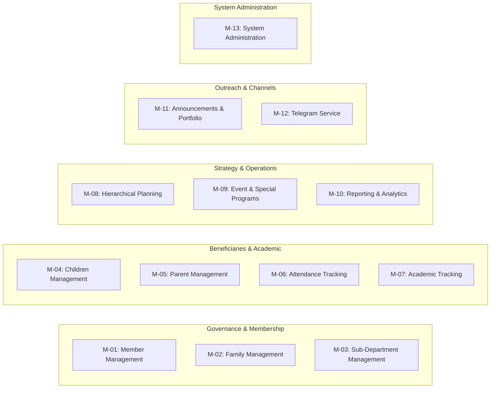

# Functional Requirements Document (FRD)

## Hitsanat Kifl Children's Ministry Management System
**Document Version:** 2.1  
**Status:** Implementation Ready  

---

## 1. System Module Inventory

The system comprises 13 functional modules spanning administrative governance, operational execution, planning hierarchy, reporting, and external integrations.

---

## 2. Granular Functional Requirements

### 2.1 Module M-01: Member Management (University Students)
- **FR-01.1 (Two-Stage Registration):**
  - *Stage 1 (Initial Fast Record Creation):* Secretary creates member records with mandatory fields: Full Name, Christian Name (የክርስትና ስም), Phone Number, Year of Study (1st Year to GC), Academic Department, Campus, Gender.
  - *Stage 2 (Enrichment & Allocation):* Assigns member to at least one Sub-Department, allocates to a Family unit, uploads profile photo, and assigns Telegram username.
- **FR-01.2 (Role Assignment):** System allows assigning executive roles (`Chairperson`, `Sub-Chairperson`, `Secretary`) and sub-department roles (`Leader`, `Sub-Leader`, `Secretary`, `Member`).
- **FR-01.3 (Multi-Department Membership):** A member may belong to multiple sub-departments simultaneously while retaining distinct role scopes within each.
- **FR-01.4 (Academic Year Continuity):** Existing members retain historical sub-department and family links across academic years without annual data purges.
- **FR-01.5 (Freshman Onboarding / Fresh Welcome):** Batch import and staged assignment workflow for newly enrolled first-year university servants.

### 2.2 Module M-02: Family System (ቤተሰብ / Khnet)
- **FR-02.1 (Family Structure Definition):** System supports creating Family units with a Name/Code and academic year designation.
- **FR-02.2 (Father and Mother Assignment):** Each family unit requires assigning exactly one Senior Male Member as **Father** (አባት) and one Senior Female Member as **Mother** (እናት).
- **FR-02.3 (Dual-Role Support):** A member serving as Father or Mother in Family A can simultaneously exist as a general member in Family B.
- **FR-02.4 (Member Allocation):** System assigns general student members to a family unit and displays family pastoral rosters to leadership.

### 2.3 Module M-03: Sub-Department Management (ክፍላት)
- **FR-03.1 (Sub-Department Registry):** Supports the five fixed sub-departments:
  1. **Timihrt (ትምህርት):** Spiritual curriculum, syllabus, teaching assignments.
  2. **Mezmur (መዝሙር):** Liturgical chants, hymn playlists, hymn conductor assignments.
  3. **Kutitr (ቁጥጥር):** Attendance, transport logistics, headcount oversight.
  4. **Ekd (እቅድ):** Strategic master planning, event scheduling, consolidated reports.
  5. **Kinetibeb (ኪነ-ጥበብ):** Religious films, theater, puppets, *Yeteret Abat* storytelling.
- **FR-03.2 (Scoped Dashboards):** Authenticated leaders access only their assigned sub-department's tools and datasets.

### 2.4 Module M-04: Children Management (Beneficiaries)
- **FR-04.1 (Child Registration):** Captures Full Name, Christian Name (የክርስትና ስም), Address, Gender, Photo, Date of Birth (Gregorian storage), Group Classification (`Kutr 1` or `Kutr 2`), and Collection Location.
- **FR-04.2 (Group Reclassification):** Kutitr leadership can reclassify a child between `Kutr 1` (younger cohort) and `Kutr 2` (older cohort) based on developmental milestones.
- **FR-04.3 (Collection Route Mapping):** Links each child to one of five physical gathering points:
  1. *Apartama*
  2. *Gende Boy*
  3. *Gende Je*
  4. *Cobalt*
  5. *Bate*
- **FR-04.4 (Birthday Milestone Query):** Identifies children born in the current Ethiopian calendar month for the monthly 15th celebration.

### 2.5 Module M-05: Parent Management
- **FR-05.1 (Parent Entity Creation):** Captures Full Name, Phone Number, Secondary Phone, Residential Address, Occupation, and Additional Pastoral Notes.
- **FR-05.2 (Cardinality Constraint):** A child record can be linked to at most **one Father** (`Relation: Father`) and **one Mother** (`Relation: Mother`).
- **FR-05.3 (Sibling Association):** Multiple children can reference the same Parent entity without duplicating parent records.

### 2.6 Module M-06: Attendance Tracking & Transport
- **FR-06.1 (Multi-Session Attendance):** Tracks attendance for `Saturday Regular`, `Sunday Regular`, `Special Event`, and `Extra Training`.
- **FR-06.2 (Auto-Seeded Attendance - ADR-0002):** When a member or child is scheduled for an activity/session, the system automatically creates an attendance record with initial status `Expected`.
- **FR-06.3 (Attendance Verification):** Kutitr officials update status to `Present`, `Absent`, or `Excused` during or immediately after the session.
- **FR-06.4 (Saturday Chaperone Route Roster):** Kutitr assigns at least two members per collection location each Saturday; creates member transport attendance records automatically.

### 2.7 Module M-07: Academic Tracking (Timihrt)
- **FR-07.1 (Assessment Types):** Records scores for `Mid Exam`, `Final Exam`, and `Assignment`.
- **FR-07.2 (Grading Schema):** Captures Subject/Topic, Numeric Score, Max Possible Score, Academic Period (e.g., 1st Semester 2016 E.C.), and Exam Date.
- **FR-07.3 (Performance Analytics):** Aggregates pass rates, top-performing students, and cohort averages by `Kutr 1` vs `Kutr 2`.

### 2.8 Module M-08: Planning Hierarchy & Action Plan Engine
- **FR-08.1 (Hierarchy Structure):**
  $$\text{Annual Master Plan} \rightarrow \text{Goals} \rightarrow \text{Main Activities} \rightarrow \text{Targets/Distribution} \rightarrow \text{Execution Schedules}$$
- **FR-08.2 (Action PLN Schema Alignment):** Direct support for the 11 core dimensions from `Action PLN.xlsx`:
  1. *Goal (ግብ)*
  2. *Main Activity (ዋና ተግባር)*
  3. *Expected Result (ውጤት)*
  4. *Annual Target (የዓመት ዕቅድ)*
  5. *Execution Period (የክንውን ጊዜ)*
  6. *Quarterly Distribution (Q1, Q2, Q3, Q4)*
  7. *Monthly Distribution (Tikimt, Hidar, Tahsas, Tir, Yekatit, Megabit, Miazia, Ginbot, Sene)*
  8. *Budget Allocation in ETB (በጀት)*
  9. *Human Resource Allocation (ሰው)*
  10. *Time / Effort Units (ጊዜ)*
  11. *Weight % (ክብደት)*
- **FR-08.3 (Weight Computation Formula):**
  $$\text{Weight}_i = \frac{1}{3} \left[ \left(\frac{\text{Budget}_i}{\sum \text{Budget}} \times 100\right) + \left(\frac{\text{People}_i}{\sum \text{People}} \times 100\right) + \left(\frac{\text{Time}_i}{\sum \text{Time}} \times 100\right) \right]$$
- **FR-08.4 (Sub-Department Plan Distribution):** Ekd assigns activities to responsible sub-departments; sub-departments break distributed tasks into weekly execution items.
- **FR-08.5 (Bottom-Up Progress Aggregation):** Weekly execution results roll up into Monthly, Quarterly, and Annual completion metrics.

### 2.9 Module M-09: Events & Special Activities
- **FR-09.1 (Event Registry):** Schedules Fixed Orthodox Feasts (*Timket*, *Hosaena*), Monthly Programs (*Awdemerit*, Birthday), and Ad-hoc Events (*Adar*, Fresh Welcome, Welfare).
- **FR-09.2 (Sub-Department Program Assignment):** Assigns specific segments of an event to sub-departments.
- **FR-09.3 (Multi-Member Assignment Rule):** System enforces that every activity or event program must have at least **two members** assigned (never a single owner).

### 2.10 Module M-10: Reporting & Analytics
- **FR-10.1 (Periodic Report Generation):** Produces structured `Weekly`, `Monthly`, `Quarterly`, `Half-Year`, and `Annual` reports.
- **FR-10.2 (Sub-Department Submission Workflow):** Sub-departments submit periodic performance data to Ekd; Ekd generates consolidated executive reports.
- **FR-10.3 (Performance Metrics):** Reports include planned target, actual achievement, completion percentage, weighted contribution, budget variance, and qualitative challenges.

### 2.11 Module M-11: Announcements & Public Portfolio
- **FR-11.1 (Publishing Hub):** Ekd and Chairperson publish announcements with target audiences (`Public`, `Members`, `Parents`).
- **FR-11.2 (Public Sync):** Published announcements and active event countdowns immediately reflect on the public Next.js portfolio website (`https://hitsanat.vercel.app`).
- **FR-11.3 (Public Live Stats):** Exposes sanitized aggregate statistics (active student members, enrolled children, completed events) without exposing PII.

### 2.12 Module M-12: Telegram Integration Service
- **FR-12.1 (Decoupled Notification Service):** Standalone bot service polls or listens for published announcement events.
- **FR-12.2 (Channel / Group Broadcasts):** Automatically posts formatted announcements, training schedules, and feast greetings to the Hitsanat Kifl Telegram group.

### 2.13 Module M-13: System Administration
- **FR-13.1 (User Account Management):** SUPER_ADMIN and CHAIRPERSON can create, list, update, reset passwords for, and deactivate user accounts. Enforced via BR-008.
- **FR-13.2 (Audit Log Viewing):** SUPER_ADMIN and CHAIRPERSON can view a chronological audit trail of administrative actions (USER_CREATED, USER_DEACTIVATED, PASSWORD_RESET) with resource type, details payload, IP address, and timestamp.
- **FR-13.3 (Permission Matrix Reference):** A static reference view showing role-based access control across all 11 resources and 5 action types (CRUD + Approve).
- **FR-13.4 (Super Admin Dashboard):** Dedicated dashboard showing system overview KPIs (user accounts, active accounts, sub-departments, API health), deactivated accounts requiring attention, recently provisioned accounts, role distribution, system health status, and system activity feed.
- **FR-13.5 (Dashboard Routing):** Role-to-dashboard routing: SUPER_ADMIN → Super Admin Dashboard, CHAIRPERSON → Chairperson Dashboard, SUB_CHAIRPERSON → Vice-Chairperson Dashboard, SECRETARY → Secretary Dashboard, MEZMUR_LEADER → Mezmur Dashboard, Sub-dept officers → redirected to their department's dashboard.

### 2.13.1 Module M-13.1: Leadership Meeting Scheduler
- **FR-13.1.1 (Meeting Creation):** CHAIRPERSON, SUB_CHAIRPERSON, and SECRETARY can create leadership meetings with title, date/time, location, agenda, and invitees (executive leaders and sub-department leaders).
- **FR-13.1.2 (Automated Reminders):** System sends automated reminders to meeting invitees 24 hours and 1 hour before the scheduled meeting via in-app notification and Telegram.
- **FR-13.1.3 (Attendance Tracking):** Meeting creator can mark attendance for each meeting (Present, Absent, Excused) and view attendance history per member.
- **FR-13.1.4 (Meeting Minutes):** Meeting creator can record and store meeting minutes with action items, assignees, and deadlines. Minutes are accessible to all invited participants.
- **FR-13.1.5 (Recurring Meetings):** Support for scheduling recurring meetings (weekly, bi-weekly, monthly) with automatic instance creation.
- **FR-13.1.6 (Meeting Calendar View):** Calendar visualization of all scheduled meetings with filtering by department and status (upcoming, completed, cancelled).

### 2.14 Module M-13 Proposed Extensions (v2.2 — Proposed, Not Yet Implemented)

> Agreed requirements from the September 2026 Super Admin review session. Full context in `Hitsanat_Kifl_System_Documentation_v2.1 (2).md` § 7.10.6.

- **FR-13.6 (Account Reactivation):** SUPER_ADMIN and CHAIRPERSON can restore deactivated accounts (unban via Supabase Admin API). New endpoint `POST /api/v1/users/:id/reactivate`; audit action `USER_REACTIVATED`; reactivation surfaced from the dashboard's "Deactivated Accounts" widget.
- **FR-13.7 (User Editing & Role Reassignment):** The existing `PATCH /api/v1/users/:id` endpoint must be exposed in the users UI, allowing full name, email, role, and linked member to be edited. Role changes re-validate BR-007 (leadership requires linked member) and BR-009 (one leadership post per member) and record a `USER_UPDATED` audit entry with a field-level diff.
- **FR-13.8 (Searchable Member Picker):** User creation and editing must link members via a searchable picker (name/phone) instead of pasting raw member UUIDs. A combined "register leader" flow (member record + account provisioning in one pass) is a stretch goal.
- **FR-13.9 (Leadership Handover Workflow):** A guided sequence for the annual leadership rotation: create successor account → reassign leadership role (BR-008) → deactivate the outgoing leader's account, with BR-009 conflict validation at each step.
- **FR-13.10 (Audit Log Filtering & Export):** The audit trail must support filtering by action type, date range, and actor, server-side pagination, and CSV export for incident review.
- **FR-13.11 (Account Self-Protection Guard Rails):** The system must reject deactivation of the acting Super Admin's own account and of the last remaining active `SUPER_ADMIN` or `CHAIRPERSON` account, preventing lockout.
- **FR-13.12 (Break-Glass Action Logging):** All write actions performed by `SUPER_ADMIN` — including those executed under the documented permission bypass (roles-and-permissions.md § 4.3) — must be recorded in the audit trail.
- **FR-13.13 (Session Revocation):** SUPER_ADMIN can force sign-out of a user's live sessions (e.g., stolen credentials) independent of account deactivation. Audit action `SESSIONS_REVOKED`.

### 2.15 Module M-14: Secretary Dashboard Extensions

- **FR-14.1 (Bulk Import/Export):** SECRETARY can import members, children, and parents via CSV/Excel files. System validates data, reports duplicates and errors, and provides import progress. Export functionality generates CSV files for all entity types.
- **FR-14.2 (Birthday & Anniversary Tracker):** Dashboard displays children's birthdays by month with age calculation. Shows member service anniversaries (date_joined). Month selector for filtering. Supports recognition of milestones (1, 5, 10, 15, 20+ years).
- **FR-14.3 (Member Transfer System):** SECRETARY can transfer members between sub-departments with documented reason. System maintains transfer audit trail (from/to sub-department, reason, transferred by, timestamp). Updates member's primary sub-department assignment.
- **FR-14.4 (Registration Analytics):** Dashboard displays registration trends over time (line chart), demographic breakdown by gender/campus/year (pie charts), sub-department distribution (bar chart), and growth metrics (new vs inactive members).
- **FR-14.5 (Batch Operations):** SECRETARY can perform bulk updates: activate/deactivate multiple members, assign multiple members to sub-dependments, update member status. Operations include confirmation dialog and progress tracking.
- **FR-14.6 (Data Quality Dashboard):** Dashboard identifies incomplete member records (missing phone, photo, department), duplicate detection (name/phone matching), and provides guided fix workflows. Shows data completeness score per field.
- **FR-14.7 (Parent Contact Directory):** Searchable directory of all parents with quick-access filters (by child name, phone, address). Supports click-to-call, copy phone number, and view linked children. Export to CSV.
- **FR-14.8 (Family Tree Visualization):** Interactive visual representation of family connections showing parents, children, and their relationships. Supports expand/collapse, click-to-view details, and print functionality.
- **FR-14.9 (Audit Trail Viewer):** SECRETARY can view chronological audit trail of all record changes (member, child, parent updates). Filterable by action type, date range, and actor. Shows before/after values for each change.

### 2.16 Module M-15: Timihrt Leader Dashboard Extensions

- **FR-15.1 (Report Card Generator - Single Student):** TIMIHRT_LEADER can generate individual student report cards in PDF format. Report card includes: student name, Christian name, photo, grades (Mid Exam, Final Exam, Assignments), attendance summary (present/absent/excused counts), teacher comments, class rank, and class average. Uses Ethiopian calendar format (e.g., 2016/2017 E.C.). Ministry-branded template.
- **FR-15.2 (Report Card Generator - Batch Generation):** TIMIHRT_LEADER can generate batch report cards for entire class as Excel spreadsheet. Includes all students with: name, Christian name, all grades, sum, average, and calculated rank. Supports filtering by Kutr group and academic period.
- **FR-15.3 (Report Card Output):** System supports both PDF download and direct print for single report cards. Batch generation produces downloadable Excel file. Print button available on report card preview.
- **FR-15.4 (Report Card Template):** Ministry-branded report card template with official logo, header, and footer. Template includes sections for: student info, academic performance, attendance, conduct/behavior, teacher signature, and principal signature lines.
- **FR-15.5 (Academic Period Selection):** TIMIHRT_LEADER can select academic period (Mid-term, Final, Annual) and Ethiopian academic year for report card generation. System validates that grades exist for selected period before generation.

### 2.17 Module M-16: Kutitr Leader Dashboard Extensions

- **FR-16.1 (Route Performance Dashboard):** KUTITR_LEADER can view statistics per transport route: attendance rate (percentage of children picked up vs expected), average pickup times, issues logged per route, and weekly trends. Dashboard includes visual charts comparing performance across all 5 collection points (Apartama, Gende Boy, Gende Je, Cobalt, Bate).
- **FR-16.2 (Parent Contact Quick View):** KUTITR_LEADER can access parent phone numbers for children on each route. Quick-access panel shows parent names and phone numbers for emergency situations during transport. Supports click-to-call functionality and search by child or parent name.
- **FR-16.3 (Emergency Contact Database):** KUTITR_LEADER can view comprehensive emergency contacts for all children including: parent names, primary phone, secondary phone, address, and any medical conditions/allergies. Searchable by child name, route, or collection point. Exportable to CSV for offline access.

### 2.18 Module M-17: Ekd Leader Dashboard Extensions

- **FR-17.1 (Plan Approval Workflow):** EKD_LEADER can submit plan changes (budget, people, time, or activity modifications) for Chairperson approval. System tracks approval status (Pending, Approved, Rejected) with timestamped comments. Chairperson and Sub-Chairperson (standing deputy authority, ADR-0018) receive notification and can approve/reject with comments. Rejected changes require revision before resubmission.
- **FR-17.2 (Sub-Department Progress Heatmap):** EKD_LEADER can view a visual heatmap showing progress across all sub-departments. Color-coded matrix displays: rows = sub-departments (Timihrt, Mezmur, Kutitr, Ekd, Kinetibeb), columns = goals/activities. Color intensity indicates completion percentage (Red: 0-25%, Orange: 26-50%, Yellow: 51-75%, Green: 76-100%). Clicking a cell shows detailed progress breakdown.
