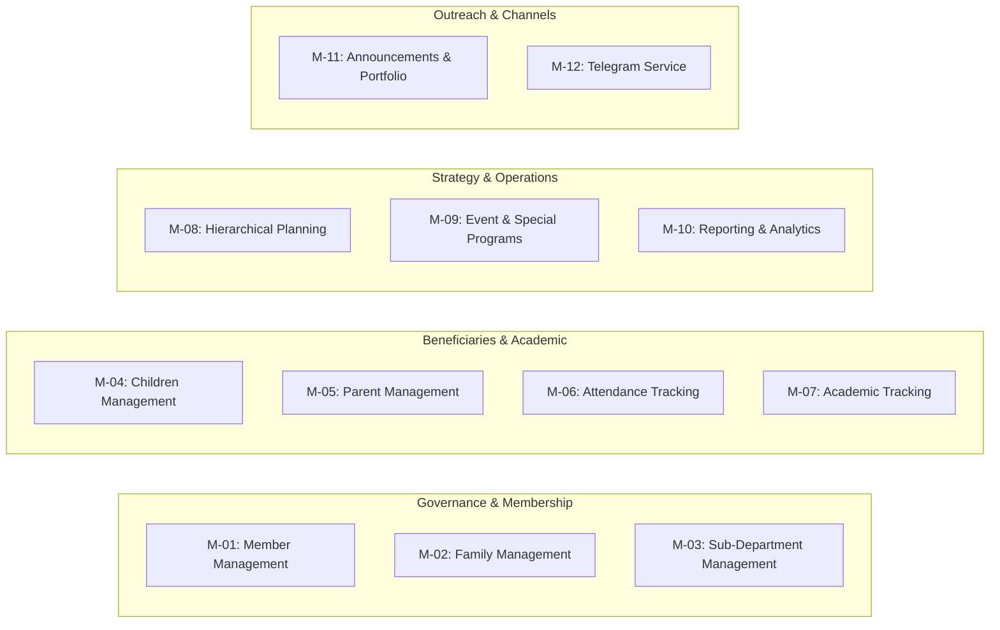

# Functional Requirements Document (FRD)

## Hitsanat Kifl Children's Ministry Management System
**Document Version:** 2.1  
**Status:** Implementation Ready  

---

## 1. System Module Inventory

The system comprises 12 functional modules spanning administrative governance, operational execution, planning hierarchy, reporting, and external integrations.

---

## 2. Granular Functional Requirements

### 2.1 Module M-01: Member Management (University Students)
- **FR-01.1 (Two-Stage Registration):**
  - *Stage 1 (Initial Fast Record Creation):* Secretary creates member records with mandatory fields: Full Name, Christian Name (የክርስትና ስም), Phone Number, Year of Study (1st Year to GC), Academic Department, Campus, Gender.
  - *Stage 2 (Enrichment & Allocation):* Assigns member to at least one Sub-Department, allocates to a Family unit, uploads profile photo, and assigns Telegram username.
- **FR-01.2 (Role Assignment):** System allows assigning executive roles (`Chairperson`, `Sub-Chairperson`, `Secretary`) and sub-department roles (`Leader`, `Sub-Leader`, `Secretary`, `Member`).
- **FR-01.3 (Multi-Department Membership):** A member may belong to multiple sub-departments simultaneously while retaining distinct role scopes within each.
- **FR-01.4 (Academic Year Continuity):** Existing members retain historical sub-department and family links across academic years without annual data purges.
- **FR-01.5 (Freshman Onboarding / Fresh Welcome):** Batch import and staged assignment workflow for newly enrolled first-year university servants.

### 2.2 Module M-02: Family System (ቤተሰብ / Khnet)
- **FR-02.1 (Family Structure Definition):** System supports creating Family units with a Name/Code and academic year designation.
- **FR-02.2 (Father and Mother Assignment):** Each family unit requires assigning exactly one Senior Male Member as **Father** (አባት) and one Senior Female Member as **Mother** (እናት).
- **FR-02.3 (Dual-Role Support):** A member serving as Father or Mother in Family A can simultaneously exist as a general member in Family B.
- **FR-02.4 (Member Allocation):** System assigns general student members to a family unit and displays family pastoral rosters to leadership.

### 2.3 Module M-03: Sub-Department Management (ክፍላት)
- **FR-03.1 (Sub-Department Registry):** Supports the five fixed sub-departments:
  1. **Timihrt (ትምህርት):** Spiritual curriculum, syllabus, teaching assignments.
  2. **Mezmur (መዝሙር):** Liturgical chants, hymn playlists, hymn conductor assignments.
  3. **Kutitr (ቁጥር):** Attendance, transport logistics, headcount oversight.
  4. **Ekd (እቅድ):** Strategic master planning, event scheduling, consolidated reports.
  5. **Kinetibeb (ቅንጥብጥብ):** Religious films, theater, puppets, *Yeteret Abat* storytelling.
- **FR-03.2 (Scoped Dashboards):** Authenticated leaders access only their assigned sub-department's tools and datasets.

### 2.4 Module M-04: Children Management (Beneficiaries)
- **FR-04.1 (Child Registration):** Captures Full Name, Christian Name (የክርስትና ስም), Address, Gender, Photo, Date of Birth (Gregorian storage), Group Classification (`Kutr 1` or `Kutr 2`), and Collection Location.
- **FR-04.2 (Group Reclassification):** Kutitr leadership can reclassify a child between `Kutr 1` (younger cohort) and `Kutr 2` (older cohort) based on developmental milestones.
- **FR-04.3 (Collection Route Mapping):** Links each child to one of five physical gathering points:
  1. *Apartama*
  2. *Gende Boy*
  3. *Gende Je*
  4. *Cobalt*
  5. *Bate*
- **FR-04.4 (Birthday Milestone Query):** Identifies children born in the current Ethiopian calendar month for the monthly 15th celebration.

### 2.5 Module M-05: Parent Management
- **FR-05.1 (Parent Entity Creation):** Captures Full Name, Phone Number, Secondary Phone, Residential Address, Occupation, and Additional Pastoral Notes.
- **FR-05.2 (Cardinality Constraint):** A child record can be linked to at most **one Father** (`Relation: Father`) and **one Mother** (`Relation: Mother`).
- **FR-05.3 (Sibling Association):** Multiple children can reference the same Parent entity without duplicating parent records.

### 2.6 Module M-06: Attendance Tracking & Transport
- **FR-06.1 (Multi-Session Attendance):** Tracks attendance for `Saturday Regular`, `Sunday Regular`, `Special Event`, and `Extra Training`.
- **FR-06.2 (Auto-Seeded Attendance - ADR-0002):** When a member or child is scheduled for an activity/session, the system automatically creates an attendance record with initial status `Expected`.
- **FR-06.3 (Attendance Verification):** Kutitr officials update status to `Present`, `Absent`, or `Excused` during or immediately after the session.
- **FR-06.4 (Saturday Chaperone Route Roster):** Kutitr assigns at least two members per collection location each Saturday; creates member transport attendance records automatically.

### 2.7 Module M-07: Academic Tracking (Timihrt)
- **FR-07.1 (Assessment Types):** Records scores for `Mid Exam`, `Final Exam`, and `Assignment`.
- **FR-07.2 (Grading Schema):** Captures Subject/Topic, Numeric Score, Max Possible Score, Academic Period (e.g., 1st Semester 2016 E.C.), and Exam Date.
- **FR-07.3 (Performance Analytics):** Aggregates pass rates, top-performing students, and cohort averages by `Kutr 1` vs `Kutr 2`.

### 2.8 Module M-08: Planning Hierarchy & Action Plan Engine
- **FR-08.1 (Hierarchy Structure):**
  $$\text{Annual Master Plan} \rightarrow \text{Goals} \rightarrow \text{Main Activities} \rightarrow \text{Targets/Distribution} \rightarrow \text{Execution Schedules}$$
- **FR-08.2 (Action PLN Schema Alignment):** Direct support for the 11 core dimensions from `Action PLN.xlsx`:
  1. *Goal (ግብ)*
  2. *Main Activity (ዋና ተግባር)*
  3. *Expected Result (ውጤት)*
  4. *Annual Target (የዓመት ዕቅድ)*
  5. *Execution Period (የክንውን ጊዜ)*
  6. *Quarterly Distribution (Q1, Q2, Q3, Q4)*
  7. *Monthly Distribution (Tikimt, Hidar, Tahsas, Tir, Yekatit, Megabit, Miazia, Ginbot, Sene)*
  8. *Budget Allocation in ETB (በጀት)*
  9. *Human Resource Allocation (ሰው)*
  10. *Time / Effort Units (ጊዜ)*
  11. *Weight % (ክብደት)*
- **FR-08.3 (Weight Computation Formula):**
  $$\text{Weight}_i = \frac{1}{3} \left[ \left(\frac{\text{Budget}_i}{\sum \text{Budget}} \times 100\right) + \left(\frac{\text{People}_i}{\sum \text{People}} \times 100\right) + \left(\frac{\text{Time}_i}{\sum \text{Time}} \times 100\right) \right]$$
- **FR-08.4 (Sub-Department Plan Distribution):** Ekd assigns activities to responsible sub-departments; sub-departments break distributed tasks into weekly execution items.
- **FR-08.5 (Bottom-Up Progress Aggregation):** Weekly execution results roll up into Monthly, Quarterly, and Annual completion metrics.

### 2.9 Module M-09: Events & Special Activities
- **FR-09.1 (Event Registry):** Schedules Fixed Orthodox Feasts (*Timket*, *Hosaena*), Monthly Programs (*Awdemerit*, Birthday), and Ad-hoc Events (*Adar*, Fresh Welcome, Welfare).
- **FR-09.2 (Sub-Department Program Assignment):** Assigns specific segments of an event to sub-departments.
- **FR-09.3 (Multi-Member Assignment Rule):** System enforces that every activity or event program must have at least **two members** assigned (never a single owner).

### 2.10 Module M-10: Reporting & Analytics
- **FR-10.1 (Periodic Report Generation):** Produces structured `Weekly`, `Monthly`, `Quarterly`, `Half-Year`, and `Annual` reports.
- **FR-10.2 (Sub-Department Submission Workflow):** Sub-departments submit periodic performance data to Ekd; Ekd generates consolidated executive reports.
- **FR-10.3 (Performance Metrics):** Reports include planned target, actual achievement, completion percentage, weighted contribution, budget variance, and qualitative challenges.

### 2.11 Module M-11: Announcements & Public Portfolio
- **FR-11.1 (Publishing Hub):** Ekd and Chairperson publish announcements with target audiences (`Public`, `Members`, `Parents`).
- **FR-11.2 (Public Sync):** Published announcements and active event countdowns immediately reflect on the public Next.js portfolio website (`https://hitsanat.vercel.app`).
- **FR-11.3 (Public Live Stats):** Exposes sanitized aggregate statistics (active student members, enrolled children, completed events) without exposing PII.

### 2.12 Module M-12: Telegram Integration Service
- **FR-12.1 (Decoupled Notification Service):** Standalone bot service polls or listens for published announcement events.
- **FR-12.2 (Channel / Group Broadcasts):** Automatically posts formatted announcements, training schedules, and feast greetings to the Hitsanat Kifl Telegram group.
